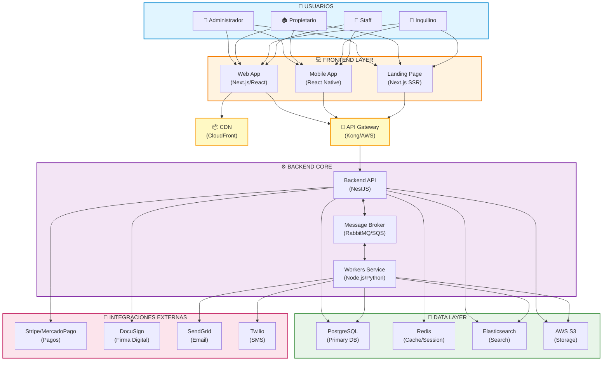

# Plataforma de Administración de Alquileres

## 📋 Descripción

Sistema integral de administración de propiedades en alquiler que centraliza y automatiza la gestión de una cartera inmobiliaria. La plataforma abarca desde la captación de interesados hasta la facturación, pasando por la firma de contratos, cobro de rentas y generación de reportes, con portales diferenciados para administradores, inquilinos y propietarios.

### Alcance

- **Propiedades**: Residenciales, comerciales y vacacionales
- **Usuarios**: Administradores, propietarios, inquilinos, personal de mantenimiento
- **Funcionalidades**: Gestión integral de propiedades, contratos, pagos, mantenimiento, reportes y CRM

## 🎯 Objetivos del Sistema

1. **Centralización**: Consolidar todos los datos críticos del negocio inmobiliario en un único sistema
2. **Automatización**: Reducir tareas manuales y errores humanos
3. **Eficiencia Operativa**: Mejorar procesos de gestión de propiedades y contratos
4. **Transparencia**: Proveer acceso en tiempo real a propietarios e inquilinos
5. **Escalabilidad**: Soportar crecimiento de docenas a miles de unidades

## 📚 Documentación

### Documentación Funcional

- **[Documento de Requerimientos Funcionales (DRF)](docs/functional/drf-original.md)**
  - Descripción completa de módulos y funcionalidades
  - Requerimientos funcionales detallados por módulo
  - Requerimientos no funcionales
  - Integraciones externas
  - Flujos críticos del sistema

### Documentación Técnica

- **[Documento de Arquitectura Técnica (DAT)](docs/technical/arquitectura.md)**
  - Arquitectura lógica y física
  - Componentes principales del sistema
  - Modelo de datos de alto nivel
  - Patrones de comunicación
  - Requisitos no funcionales (seguridad, escalabilidad, disponibilidad)
  - Estrategia de despliegue
  - Integraciones con terceros
  - Stack tecnológico recomendado

- **[Diagramas C4 (Modelo de Arquitectura)](docs/technical/c4-model.md)**
  - **C4 Nivel 1 - Contexto**: Vistas del sistema y sistemas externos (simplificada, detallada y completa)
  - **C4 Nivel 2 - Contenedores**: Vistas de arquitectura interna (frontend, backend, data layer y completa)
  - **C4 Nivel 3 - Componentes**: Vistas de componentes del Backend API (core, operaciones, soporte, integraciones)
  - **C4 Nivel 4 - Código**: Diagramas de clases por módulo (core, financiero, operaciones, soporte, integraciones)

- **[Modelo de Datos (ERD)](docs/technical/der.md)**
  - Dominio Core: Usuarios y autenticación
  - Dominio de Propiedades
  - Dominio de Contratos (Leases)
  - Dominio Financiero (Pagos e Invoicing)
  - Dominio de Operaciones (Mantenimiento)
  - Dominio de Sistema (CRM, Reportes, Logs)
  - Vista consolidada de relaciones

- **[Diagramas de Secuencia](docs/technical/sequence.md)**
  - Cobro recurrente automático
  - Firma digital de contrato
  - Solicitud de mantenimiento
  - Registro de nuevo alquiler
  - Generación de reportes
  - Captura y seguimiento de leads (CRM)
  - Renovación de contrato

### Plan de Trabajo

- **[Plan de Trabajo](docs/plan-de-trabajo.md)**
  - 6 fases principales de implementación
  - 505+ tareas detalladas con Story Points
  - Criterios de éxito por fase
  - Análisis de riesgos y mitigaciones
  - Hitos clave del proyecto
  - Roadmap de features futuras

## 🏗️ Arquitectura del Sistema

### Estilo Arquitectónico

**Modular Monolito** (inicio) → **Microservicios** (escalamiento futuro)

### Componentes Principales

### Stack Tecnológico Recomendado

**Backend**
- Node.js (NestJS) o Python (FastAPI)
- PostgreSQL + Redis
- RabbitMQ / AWS SQS
- Elasticsearch

**Frontend**
- Next.js + React
- Tailwind CSS / styled-components
- PWA Support

**Infraestructura**
- Docker + Kubernetes
- Terraform (IaC)
- AWS / Azure / GCP
- GitHub Actions (CI/CD)

**Integraciones Clave**
- Stripe / MercadoPago (Pagos)
- DocuSign (Firma digital)
- SendGrid (Email)
- Twilio (SMS)
- AWS S3 (Almacenamiento)

## 🚀 Fases del Proyecto

| Fase | Descripción | Story Points |
|------|-------------|--------------|
| **Fase 0** | Preparación e Infraestructura | 31 SP |
| **Fase 1** | MVP - Core Business | 120 SP |
| **Fase 2** | Integraciones Externas | 75 SP |
| **Fase 3** | Funcionalidades Avanzadas | 107 SP |
| **Fase 4** | Optimización y Escalamiento | 72 SP |
| **Fase 5** | Preparación para Producción | 67 SP |
| **Fase 6** | Go-Live y Estabilización | 33 SP |
| **TOTAL** | | **505 SP** |

## 📦 Módulos Principales

### Core Business
- ✅ **Gestión de Propiedades**: CRUD, búsqueda, imágenes, documentos
- ✅ **Gestión de Contratos**: Creación, renovación, firma digital, alertas
- ✅ **Gestión de Inquilinos**: CRUD, validaciones, historial
- ✅ **Autenticación y RBAC**: Login, roles, permisos

### Operaciones
- 💰 **Gestión de Pagos**: Pagos online, recurrentes, mora, recibos
- 🔧 **Mantenimiento**: Tickets, asignación, seguimiento, fotos
- 📊 **CRM**: Leads, seguimiento, conversión, emparejamiento automático

### Soporte
- 📈 **Reportes**: Rent roll, estado de cuenta, morosidad, flujo de caja
- 🔔 **Notificaciones**: Email, SMS, Push, alertas automatizadas
- 📄 **Documentos**: Generación PDF, almacenamiento, firma digital
- 🔍 **Auditoría**: Logs de cambios, trazabilidad completa

### Portales
- 🏢 **Portal Administrativo**: Gestión completa del sistema
- 🏠 **Portal de Propietarios**: Consulta de rendimiento, pagos, reportes
- 🏡 **Portal de Inquilinos**: Pagos online, contratos, tickets de mantenimiento

## 🔐 Seguridad y Compliance

- 🔒 **Autenticación**: JWT + Refresh Tokens
- 🛡️ **Autorización**: RBAC (Role-Based Access Control)
- 🔐 **Cifrado**: TLS en tránsito, KMS en reposo
- 📝 **Auditoría**: Log completo de acciones
- 🔍 **Monitoreo**: Detección de anomalías
- ⚖️ **Compliance**: GDPR/LOPD ready

## 📊 Métricas y Observabilidad

### Logging
- Fluentd/Logstash → Elasticsearch → Kibana

### Métricas
- Prometheus → Grafana

### Trazabilidad
- Jaeger / AWS X-Ray

### Alertas
- PagerDuty / Opsgenie

## 🎯 KPIs del Sistema

- **SLA**: 99.9% uptime
- **Performance**: API <500ms (p95)
- **Seguridad**: 0 vulnerabilidades críticas
- **Cobertura de Tests**: >70%
- **Disponibilidad**: 24/7

## 🌟 Features Futuras

- 🤖 **IA para fijación de precios**: ML para rentas óptimas
- 🏠 **Integración con portales**: Airbnb, Zillow, Idealista
- 💬 **Chatbot de atención**: Respuestas automáticas
- 📱 **App móvil nativa**: React Native/Flutter
- 🔄 **Renovaciones inteligentes**: Propuestas automáticas basadas en historial
- 📊 **Dashboard de BI avanzado**: Análisis predictivo
- 🏭 **IoT**: Sensores para mantenimiento preventivo

## 📖 Cómo Usar Esta Documentación

### Para Product Owners / Stakeholders
1. Leer [DRF](docs/functional/drf-original.md) para entender funcionalidades
2. Revisar [Plan de Trabajo](docs/plan-de-trabajo.md) para timeline y fases

### Para Arquitectos / Tech Leads
1. Estudiar [Documento de Arquitectura](docs/technical/arquitectura.md)
2. Revisar [Diagramas C4](docs/technical/c4-model.md) para entender capas
3. Analizar [Modelo de Datos](docs/technical/der.md)

### Para Desarrolladores
1. Revisar [Diagramas de Secuencia](docs/technical/sequence.md) para flujos
2. Consultar [C4 Nivel 4](docs/technical/c4-model.md#4-código-c4-nivel-4) para diseño de clases
3. Seguir [Plan de Trabajo](docs/plan-de-trabajo.md) para tareas específicas

### Para QA / Testers
1. Usar [DRF](docs/functional/drf-original.md) como base para casos de prueba
2. Revisar [Diagramas de Secuencia](docs/technical/sequence.md) para flujos E2E

## 🤝 Contribución

Este es un proyecto de documentación completo y detallado. Para implementación:

1. Seguir el [Plan de Trabajo](docs/plan-de-trabajo.md)
2. Respetar la arquitectura definida en [DAT](docs/technical/arquitectura.md)
3. Implementar según [Diagramas C4](docs/technical/c4-model.md)
4. Mantener coherencia con [Modelo de Datos](docs/technical/der.md)

## 📝 Notas

- **Versión**: 1.0
- **Estado**: Documentación completa - Listo para implementación
- **Próximos pasos**: Fase 0 - Preparación e Infraestructura

## 📧 Contacto

Para consultas sobre esta documentación, referirse al equipo de arquitectura del proyecto.

---

**© 2025 - Plataforma de Administración de Alquileres**
