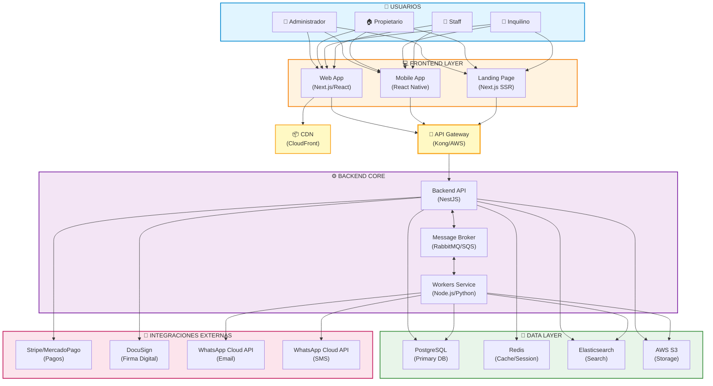

# Sistema de Gestión Inmobiliaria

[]()
[]()
[]()
[](https://github.com/andrescastiglia/rent/actions/workflows/ci.yml)
[](#estado-tecnico-actual)
[](#estado-tecnico-actual)
[](#estado-tecnico-actual)
[](.github/workflows/ci.yml)
[](#estado-tecnico-actual)

## 📋 Descripción

Sistema integral para la gestión inmobiliaria que centraliza propiedades en venta, alquileres, pagos, vencimientos y renovaciones. La plataforma abarca desde la captación de interesados hasta la facturación, pasando por visitas comerciales, contratos, cobro de rentas, liquidaciones y generación de reportes, con portales diferenciados para administradores, inquilinos y propietarios.

### Alcance

- **Propiedades**: Residenciales, comerciales y vacacionales, en venta o alquiler
- **Usuarios**: Administradores, propietarios, inquilinos, personal de mantenimiento
- **Funcionalidades**: Gestión integral de propiedades, contratos, pagos, mantenimiento, vencimientos, renovaciones, reportes y CRM

### Ingreso Operativo Actual

- **Panel de Propiedades**: acceso directo a propiedades en venta, alquileres vigentes, vencimientos del mes y ventana de renovación de cuatro meses.
- **Panel de Pagos**: seguimiento por propiedad y contrato con actividad del pago, fecha, estado y acceso rápido al detalle.
- **Visitas Comerciales**: registro de visitas por propiedad con datos del interesado, comentarios y ofertas, preparado para aviso al propietario por WhatsApp.
- **Alertas de Renovación**: vencimientos visibles y alertas automáticas configurables con periodicidad mensual, cada cuatro meses o personalizada.

## 🎯 Objetivos del Sistema

1. **Centralización**: Consolidar todos los datos críticos del negocio inmobiliario en un único sistema
2. **Automatización**: Reducir tareas manuales y errores humanos
3. **Eficiencia Operativa**: Mejorar procesos de gestión de propiedades y contratos
4. **Transparencia**: Proveer acceso en tiempo real a propietarios e inquilinos
5. **Escalabilidad**: Soportar crecimiento de docenas a miles de unidades

## 🚀 Getting Started

### Configuración Rápida del Entorno Local

El proyecto incluye un entorno de desarrollo local completo con Docker Compose.

#### Requisitos

- Docker 20.10+
- Docker Compose 2.0+
- Make

#### Instalación en 3 Pasos

```bash
# 1. Clonar el repositorio
git clone <url-del-repositorio>
cd rent

# 2. Setup automático (crea .env, inicia servicios, verifica conexiones)
make setup

# 3. Verificar que todo funciona
make healthcheck
```

#### Servicios Incluidos

- **PostgreSQL 16** - Base de datos principal (puerto 5432)
- **Redis 7** - Caché y sesiones (puerto 6379)
- **RabbitMQ 3** - Message broker (puerto 5672, Management UI: 15672)
- **pgAdmin 4** - Administración visual de BD (puerto 5050, opcional)

#### Comandos Útiles

```bash
make help          # Ver todos los comandos disponibles
make up            # Iniciar servicios
make down          # Detener servicios
make logs          # Ver logs
make db-shell      # Abrir shell de PostgreSQL
make info          # Ver información de conexión
```

#### Batch Operativo

```bash
# Simular alertas de renovación de alquileres
cd batch && npm run dev -- lease-renewal-alerts --dry-run

# Ejecutar alertas de renovación para la fecha actual
cd batch && npm run dev -- lease-renewal-alerts
```

📖 **Documentación completa**: [Guía de Configuración Local](docs/development/local-setup.md)

Si vas a usar autenticación con CAPTCHA, revisá la sección **CAPTCHA (Turnstile)** en la guía para configurar:
- `TURNSTILE_SECRET_KEY`
- `NEXT_PUBLIC_TURNSTILE_SITE_KEY`

## 📈 Observabilidad (Prometheus)

- **Backend** expone métricas en `GET /metrics`.
- **Frontend** reporta Web Vitals y errores a `POST /frontend-metrics` (ingestados por backend).
- **Batch** reporta métricas de ejecución a Pushgateway cuando `PROMETHEUS_PUSHGATEWAY_URL` está configurado.

Variables sugeridas en `.env`:

```bash
PROMETHEUS_PUSHGATEWAY_URL=http://localhost:9091
PROMETHEUS_PUSHGATEWAY_JOB=rent_batch
# opcional
PROMETHEUS_PUSHGATEWAY_INSTANCE=rent-batch-dev
```

## 🔍 Traces (OpenTelemetry)

- **Backend** y **Batch** inicializan OpenTelemetry Node SDK y exportan traces vía OTLP (`OTEL_EXPORTER_OTLP_*`).
- **Frontend** inicializa OpenTelemetry Web SDK y traza navegación + `fetch` (`NEXT_PUBLIC_OTEL_EXPORTER_OTLP_*`).
- La infraestructura de trazas (Collector/Tempo/Grafana) no está incluida aquí.

## 🔬 Profiling Continuo (Pyroscope)

- **Backend** y **Batch** integran `@pyroscope/nodejs` para profiling continuo.
- Activación por variables `PYROSCOPE_*` (requiere `PYROSCOPE_SERVER_ADDRESS`).
- Frontend browser no usa Pyroscope (se recomienda Web Vitals/RUM).

## 📚 Documentación

### Documentación Funcional

- **[Documento de Requerimientos Funcionales (DRF)](docs/functional/drf-original.md)**
  - Descripción completa de módulos y funcionalidades
  - Requerimientos funcionales detallados por módulo
  - Requerimientos no funcionales
  - Integraciones externas
  - Flujos críticos del sistema

### Documentación Técnica

- **[Documento de Arquitectura Técnica (DAT)](docs/technical/arquitectura.md)**
  - Arquitectura lógica y física
  - Componentes principales del sistema
  - Modelo de datos de alto nivel
  - Patrones de comunicación
  - Requisitos no funcionales (seguridad, escalabilidad, disponibilidad)
  - Estrategia de despliegue
  - Integraciones con terceros
  - Stack tecnológico recomendado

- **[Diagramas C4 (Modelo de Arquitectura)](docs/technical/c4-model.md)**
  - **C4 Nivel 1 - Contexto**: Vistas del sistema y sistemas externos (simplificada, detallada y completa)
  - **C4 Nivel 2 - Contenedores**: Vistas de arquitectura interna (frontend, backend, data layer y completa)
  - **C4 Nivel 3 - Componentes**: Vistas de componentes del Backend API (core, operaciones, soporte, integraciones)
  - **C4 Nivel 4 - Código**: Diagramas de clases por módulo (core, financiero, operaciones, soporte, integraciones)

- **[Modelo de Datos (ERD)](docs/technical/der.md)**
  - Dominio Core: Usuarios y autenticación
  - Dominio de Propiedades
  - Dominio de Contratos (Leases)
  - Dominio Financiero (Pagos e Invoicing)
  - Dominio de Operaciones (Mantenimiento)
  - Dominio de Sistema (CRM, Reportes, Logs)
  - Vista consolidada de relaciones

- **[Diagramas de Secuencia](docs/technical/sequence.md)**
  - Cobro recurrente automático
  - Firma digital de contrato
  - Solicitud de mantenimiento
  - Registro de nuevo alquiler
  - Generación de reportes
  - Captura y seguimiento de leads (CRM)
  - Renovación de contrato

- **[Observabilidad Prometheus](docs/technical/observability-prometheus.md)**
  - Métricas de backend, frontend y batch
  - Reglas de alerta sugeridas

### Plan de Trabajo

- **[Plan de Trabajo](docs/plan-de-trabajo.md)**
  - 6 fases principales de implementación
  - 505+ tareas detalladas con Story Points
  - Criterios de éxito por fase
  - Análisis de riesgos y mitigaciones
  - Hitos clave del proyecto
  - Roadmap de features futuras

## 🏗️ Arquitectura del Sistema

### Estilo Arquitectónico

**Modular Monolito** (inicio) → **Microservicios** (escalamiento futuro)

### Componentes Principales


```mermaid
graph TB
    subgraph usuarios["👥 USUARIOS"]
        admin["🔑 Administrador"]
        owner["🏠 Propietario"]
        tenant["🏡 Inquilino"]
        staff["🔧 Staff"]
    end

    subgraph frontend["💻 FRONTEND LAYER"]
        webapp["Web App<br/>(Next.js/React)"]
        mobile["Mobile App<br/>(React Native)"]
        landing["Landing Page<br/>(Next.js SSR)"]
    end

    cdn["📦 CDN<br/>(CloudFront)"]
    gateway["🚪 API Gateway<br/>(Kong/AWS)"]

    subgraph backend["⚙️ BACKEND CORE"]
        api["Backend API<br/>(NestJS)"]
        workers["Workers Service<br/>(Node.js/Python)"]
        queue["Message Broker<br/>(RabbitMQ/SQS)"]
    end

    subgraph data["💾 DATA LAYER"]
        postgres["PostgreSQL<br/>(Primary DB)"]
        redis["Redis<br/>(Cache/Session)"]
        elastic["Elasticsearch<br/>(Search)"]
        s3["AWS S3<br/>(Storage)"]
    end

    subgraph external["🔌 INTEGRACIONES EXTERNAS"]
        stripe["Stripe/MercadoPago<br/>(Pagos)"]
        docusign["DocuSign<br/>(Firma Digital)"]
        sendgrid["WhatsApp Cloud API<br/>(Email)"]
        twilio["WhatsApp Cloud API<br/>(SMS)"]
    end

    %% Usuarios a Frontend
    admin & owner & tenant & staff --> webapp
    admin & owner & tenant & staff --> mobile
    admin & owner & tenant --> landing

    %% Frontend a Gateway
    webapp --> cdn
    webapp & mobile & landing --> gateway

    %% Gateway a Backend
    gateway --> api

    %% Backend Internal
    api <--> queue
    queue <--> workers

    %% Backend a Data Layer
    api --> postgres
    api --> redis
    api --> elastic
    api --> s3
    workers --> postgres
    workers --> s3
    workers --> elastic

    %% Backend a External
    api --> stripe
    api --> docusign
    workers --> sendgrid
    workers --> twilio

    style usuarios fill:#e1f5ff,stroke:#0288d1,stroke-width:2px
    style frontend fill:#fff3e0,stroke:#f57c00,stroke-width:2px
    style backend fill:#f3e5f5,stroke:#7b1fa2,stroke-width:2px
    style data fill:#e8f5e9,stroke:#388e3c,stroke-width:2px
    style external fill:#fce4ec,stroke:#c2185b,stroke-width:2px

    style gateway fill:#fff9c4,stroke:#f9a825,stroke-width:3px
    style cdn fill:#fff9c4,stroke:#f9a825,stroke-width:2px
```

### Stack Tecnológico Recomendado

**Backend**
- Node.js (NestJS) o Python (FastAPI)
- PostgreSQL + Redis
- RabbitMQ / AWS SQS
- Elasticsearch

**Frontend**
- Next.js + React
- Tailwind CSS / styled-components
- PWA Support

**Infraestructura**
- Docker + Kubernetes
- Terraform (IaC)
- AWS / Azure / GCP
- GitHub Actions (CI/CD)

**Integraciones Clave**
- Stripe / MercadoPago (Pagos)
- DocuSign (Firma digital)
- WhatsApp Cloud API (Email)
- WhatsApp Cloud API (SMS)
- AWS S3 (Almacenamiento)

## 🚀 Fases del Proyecto

| Fase | Descripción | Story Points |
|------|-------------|--------------|
| **Fase 0** | Preparación e Infraestructura | 31 SP |
| **Fase 1** | MVP - Core Business | 120 SP |
| **Fase 2** | Integraciones Externas | 75 SP |
| **Fase 3** | Funcionalidades Avanzadas | 107 SP |
| **Fase 4** | Optimización y Escalamiento | 72 SP |
| **Fase 5** | Preparación para Producción | 67 SP |
| **Fase 6** | Go-Live y Estabilización | 33 SP |
| **TOTAL** | | **505 SP** |

## 📦 Módulos Principales

### Core Business
- ✅ **Gestión de Propiedades**: CRUD, búsqueda, imágenes, documentos
- ✅ **Gestión de Contratos**: Creación, renovación, firma digital, alertas
- ✅ **Gestión de Inquilinos**: CRUD, validaciones, historial
- ✅ **Autenticación y RBAC**: Login, roles, permisos

### Operaciones
- 💰 **Gestión de Pagos**: Pagos online, recurrentes, mora, recibos
- 🔧 **Mantenimiento**: Tickets, asignación, seguimiento, fotos
- 📊 **CRM**: Leads, seguimiento, conversión, emparejamiento automático

### Soporte
- 📈 **Reportes**: Rent roll, estado de cuenta, morosidad, flujo de caja
- 🔔 **Notificaciones**: Email, SMS, Push, alertas automatizadas
- 📄 **Documentos**: Generación PDF, almacenamiento, firma digital
- 🔍 **Auditoría**: Logs de cambios, trazabilidad completa

### Portales
- 🏢 **Portal Administrativo**: Gestión completa del sistema
- 🏠 **Portal de Propietarios**: Consulta de rendimiento, pagos, reportes
- 🏡 **Portal de Inquilinos**: Pagos online, contratos, tickets de mantenimiento

## 🔐 Seguridad y Compliance

- 🔒 **Autenticación**: JWT + Refresh Tokens
- 🛡️ **Autorización**: RBAC (Role-Based Access Control)
- 🔐 **Cifrado**: TLS en tránsito, KMS en reposo
- 📝 **Auditoría**: Log completo de acciones
- 🔍 **Monitoreo**: Detección de anomalías
- ⚖️ **Compliance**: GDPR/LOPD ready

## 📊 Métricas y Observabilidad

### Logging
- Fluentd/Logstash → Elasticsearch → Kibana

### Métricas
- Prometheus → Grafana

### Trazabilidad
- Jaeger / AWS X-Ray

### Alertas
- PagerDuty / Opsgenie

## 🎯 KPIs del Sistema

- **SLA**: 99.9% uptime
- **Performance**: API <500ms (p95)
- **Seguridad**: 0 vulnerabilidades críticas
- **Cobertura de Tests**: >70%
- **Disponibilidad**: 24/7

## 🌟 Features Futuras

- 🤖 **IA para fijación de precios**: ML para rentas óptimas
- 🏠 **Integración con portales**: Airbnb, Zillow, Idealista
- 💬 **Chatbot de atención**: Respuestas automáticas
- 📱 **App móvil nativa**: React Native/Flutter
- 🔄 **Renovaciones inteligentes**: Propuestas automáticas basadas en historial
- 📊 **Dashboard de BI avanzado**: Análisis predictivo
- 🏭 **IoT**: Sensores para mantenimiento preventivo

## 📖 Cómo Usar Esta Documentación

### Para Product Owners / Stakeholders
1. Leer [DRF](docs/functional/drf-original.md) para entender funcionalidades
2. Revisar [Plan de Trabajo](docs/plan-de-trabajo.md) para timeline y fases

### Para Arquitectos / Tech Leads
1. Estudiar [Documento de Arquitectura](docs/technical/arquitectura.md)
2. Revisar [Diagramas C4](docs/technical/c4-model.md) para entender capas
3. Analizar [Modelo de Datos](docs/technical/der.md)

### Para Desarrolladores
1. Revisar [Diagramas de Secuencia](docs/technical/sequence.md) para flujos
2. Consultar [C4 Nivel 4](docs/technical/c4-model.md#4-código-c4-nivel-4) para diseño de clases
3. Seguir [Plan de Trabajo](docs/plan-de-trabajo.md) para tareas específicas

### Para QA / Testers
1. Usar [DRF](docs/functional/drf-original.md) como base para casos de prueba
2. Revisar [Diagramas de Secuencia](docs/technical/sequence.md) para flujos E2E

## 🤝 Contribución

Este es un proyecto de documentación completo y detallado. Para implementación:

1. Seguir el [Plan de Trabajo](docs/plan-de-trabajo.md)
2. Respetar la arquitectura definida en [DAT](docs/technical/arquitectura.md)
3. Implementar según [Diagramas C4](docs/technical/c4-model.md)
4. Mantener coherencia con [Modelo de Datos](docs/technical/der.md)

## 📝 Notas

- **Versión**: 1.0
- **Estado**: Documentación completa - Listo para implementación
- **Próximos pasos**: Fase 0 - Preparación e Infraestructura

## 📧 Contacto

Para consultas sobre esta documentación, referirse al equipo de arquitectura del proyecto.

---

**© 2025 - Sistema de Gestión Inmobiliaria**
