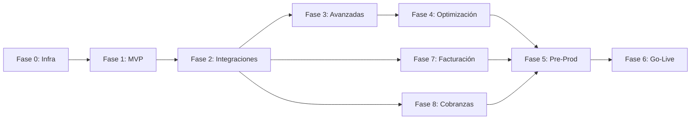

# Plan de Trabajo - Plataforma de Administración de Alquileres

**Versión**: 2.0  
**Método de Estimación**: Story Points (SP) - 1 SP ≈ 1 día

---

## Resumen Ejecutivo

Este plan de trabajo detalla la implementación completa de la Plataforma de Administración de Alquileres, basándose en:
- **Documento de Requerimientos Funcionales (DRF)**
- **Documento de Arquitectura Técnica (DAT)**
- **Diagramas C4** (Contexto, Contenedores, Componentes, Código)
- **Modelo de Datos (ERD)**
- **Diagramas de Secuencia**

El proyecto se divide en **9 fases principales**:
- Fases 0-6: Core de la plataforma
- Fase 7: Sistema de Facturación por Lotes
- Fase 8: Sistema de Cobranzas y Liquidaciones

---

## Fase 0: Preparación e Infraestructura

### Objetivo
Establecer la base técnica y organizativa del proyecto.

### Tareas

#### 0.1 Configuración del Proyecto
- **T001**: Crear repositorios Git (frontend, backend, infrastructure) **[2 SP]**
  - Estructura de mono-repo o multi-repo
  - Configuración de ramas (main, develop, feature/*)
  - Políticas de commits y PR
  
- **T002**: Configurar herramientas de gestión de proyecto **[1 SP]**
  - Jira/Linear/GitHub Projects
  - Tableros Kanban/Scrum
  - Definir workflow de tareas

- **T003**: Establecer estándares de código **[2 SP]**
  - Guías de estilo (ESLint, Prettier, etc.)
  - Convenciones de nombrado
  - Documentación de código

#### 0.2 Infraestructura Base (IaC)

- **T004**: Configurar entorno de desarrollo local **[3 SP]**
  - Docker Compose para servicios locales
  - PostgreSQL + Redis + RabbitMQ
  - Scripts de inicialización

- **T005**: Crear infraestructura cloud con Terraform **[5 SP]**
  - VPC, subnets, security groups
  - RDS PostgreSQL (staging + prod)
  - ElastiCache Redis
  - S3 buckets para documentos
  - SQS/RabbitMQ para mensajería
  
- **T006**: Configurar Kubernetes (EKS/GKE/AKS) **[5 SP]**
  - Cluster staging y production
  - Namespaces por entorno
  - Ingress controller
  - Helm charts base

#### 0.3 CI/CD Pipeline

- **T007**: Configurar GitHub Actions / GitLab CI **[4 SP]**
  - Pipeline de build
  - Tests unitarios automáticos
  - Análisis de código (SonarQube)
  - Build y push de imágenes Docker

- **T008**: Implementar CD a staging **[3 SP]**
  - Deploy automático a staging
  - Smoke tests post-deploy
  - Rollback automático en caso de fallo

#### 0.4 Observabilidad

- **T009**: Implementar stack de logging **[3 SP]**
  - Fluentd/Logstash → Elasticsearch
  - Kibana para visualización
  - Configurar índices y retención

- **T010**: Configurar métricas y monitoreo **[3 SP]**
  - Prometheus para métricas
  - Grafana dashboards
  - Alertas básicas (CPU, memoria, disco)

**Total Fase 0**: 31 SP

**Criterios de Éxito**:
- ✅ Infraestructura cloud operativa (staging)
- ✅ Pipeline CI/CD funcional
- ✅ Entorno local de desarrollo documentado
- ✅ Logs y métricas básicas funcionando

---

## Fase 1: MVP - Core Business

### Objetivo
Implementar la funcionalidad mínima viable con los módulos core del negocio.

### 1.1 Backend Core - Autenticación y Usuarios

- **T101**: Diseño e implementación del modelo de datos core **[5 SP]**
  - Migrations de PostgreSQL
  - Entidades: User, Role, Permission
  - Índices y constraints

- **T102**: Módulo de Autenticación **[8 SP]**
  - Registro de usuarios
  - Login con JWT
  - Refresh tokens
  - Recuperación de contraseña
  - Tests unitarios e integración

- **T103**: Sistema RBAC (Control de Acceso) **[5 SP]**
  - Definición de roles y permisos
  - Guards y decorators
  - Middleware de autorización
  - Tests de autorización

- **T104**: API de gestión de usuarios **[3 SP]**
  - CRUD de usuarios
  - Cambio de contraseña
  - Perfil de usuario
  - Validaciones

### 1.2 Backend Core - Propiedades

- **T111**: Modelo de datos de propiedades **[4 SP]**
  - Entidades: Property, Unit, PropertyFeature
  - Tipos de propiedades
  - Migrations y seeds de prueba

- **T112**: API de Propiedades **[8 SP]**
  - CRUD de propiedades
  - Gestión de unidades
  - Búsqueda y filtros
  - Geocodificación de direcciones
  - Validaciones de negocio

- **T113**: Gestión de imágenes y documentos **[5 SP]**
  - Upload a S3 con pre-signed URLs
  - Thumbnails automáticos
  - Asociación con propiedades
  - Límites de tamaño y formatos

### 1.3 Backend Core - Inquilinos

- **T121**: Modelo de datos de inquilinos **[3 SP]**
  - Entidad Tenant con datos personales
  - Documentos de identidad
  - Historial y referencias

- **T122**: API de Inquilinos **[6 SP]**
  - CRUD de inquilinos
  - Búsqueda por nombre/documento
  - Verificación de documentos
  - Historial de pagos (vista)

### 1.4 Backend Core - Contratos (Leases)

- **T131**: Modelo de datos de contratos **[5 SP]**
  - Entidades: Lease, LeaseAmendment
  - Estados del contrato
  - Cláusulas y condiciones
  - Migrations

- **T132**: API de Contratos **[10 SP]**
  - Crear contrato (draft)
  - Activar contrato
  - Renovar contrato
  - Terminar contrato
  - Enmiendas al contrato
  - Alertas de vencimiento

- **T133**: Generación de documentos PDF (contratos) **[6 SP]**
  - Integración con librería de PDF (PDFKit/Puppeteer)
  - Templates de contrato
  - Variables dinámicas
  - API para descargar contrato

### 1.5 Frontend Base - Portal Web

- **T141**: Setup del proyecto frontend **[3 SP]**
  - Next.js + React
  - Tailwind CSS
  - Estructura de carpetas
  - Routing

- **T142**: Sistema de autenticación frontend **[5 SP]**
  - Páginas de login/registro
  - Manejo de tokens
  - Rutas protegidas
  - Refresh token automático

- **T143**: Layout y navegación principal **[4 SP]**
  - Header con menú
  - Sidebar de navegación
  - Breadcrumbs
  - Responsive design

- **T144**: Módulo de Propiedades (UI) **[8 SP]**
  - Lista de propiedades
  - Detalle de propiedad
  - Formulario crear/editar
  - Upload de imágenes
  - Integración con API

- **T145**: Módulo de Inquilinos (UI) **[6 SP]**
  - Lista de inquilinos
  - Detalle de inquilino
  - Formulario crear/editar
  - Búsqueda y filtros

- **T146**: Módulo de Contratos (UI) **[8 SP]**
  - Lista de contratos
  - Detalle de contrato
  - Wizard de creación
  - Previsualización de PDF
  - Estados y alertas

### 1.6 Base de Datos y Seeds

- **T151**: Scripts de seeds de datos de prueba **[3 SP]**
  - Usuarios de diferentes roles
  - Propiedades de ejemplo
  - Inquilinos de prueba
  - Contratos activos y vencidos

### 1.7 Testing MVP

- **T161**: Tests unitarios backend (70% coverage) **[8 SP]**
  - Tests de servicios
  - Tests de controladores
  - Tests de autenticación/autorización

- **T162**: Tests de integración API **[5 SP]**
  - Tests end-to-end de flujos principales
  - Tests de creación de propiedad
  - Tests de creación de contrato

- **T163**: Tests E2E frontend críticos **[5 SP]**
  - Login flow
  - Crear propiedad
  - Crear contrato
  - Cypress/Playwright

**Total Fase 1**: 120 SP

**Criterios de Éxito**:
- ✅ Usuarios pueden autenticarse
- ✅ CRUD completo de Propiedades, Inquilinos y Contratos
- ✅ Generación básica de PDF de contrato
- ✅ Portal web funcional con navegación
- ✅ Tests con >70% coverage

---

## Fase 2: Integraciones Externas

### Objetivo
Integrar servicios externos críticos para el negocio.

### 2.1 Módulo de Pagos Básico

- **T201**: Modelo de datos de pagos **[4 SP]**
  - Entidades: Payment, Invoice
  - Estados de pago
  - Métodos de pago
  - Migrations

- **T202**: Integración con Stripe (futuras versiones) **[8 SP]**
  - Configuración de cuenta Stripe
  - Implementar Strategy pattern para PSPs
  - Crear payment intents
  - Webhooks de confirmación
  - Manejo de errores y reintentos

- **T203**: Integración con MercadoPago **[6 SP]**
  - Implementación de Strategy para MP
  - Checkout Pro
  - Webhooks IPN
  - Testing en sandbox

- **T204**: API de Pagos **[7 SP]**
  - Registrar pago manual
  - Iniciar pago online
  - Consultar estado de pago
  - Historial de pagos
  - Cálculo de mora

- **T205**: Generación de facturas/recibos PDF **[5 SP]**
  - Template de factura/recibo
  - Numeración automática
  - Envío por email
  - API para descargar

### 2.2 Firma Digital

- **T211**: Integración con DocuSign **[8 SP]**
  - Configuración de cuenta
  - API de creación de sobres
  - Envío de documentos para firma
  - Webhook de firma completada
  - Descarga de documento firmado

- **T212**: Flujo de firma de contrato **[6 SP]**
  - Generar PDF de contrato
  - Enviar para firma
  - Actualizar estado cuando se firma
  - Notificaciones a las partes

### 2.3 Notificaciones

- **T221**: Servicio de notificaciones **[5 SP]**
  - Abstraer NotificationService
  - Plantillas de emails
  - Sistema de cola para notificaciones

- **T222**: Integración con SendGrid (Email) **[4 SP]**
  - Configuración de API key
  - Templates en SendGrid
  - Envío de emails transaccionales
  - Tracking de envíos

- **T223**: Integración con Twilio (SMS) **[4 SP]**
  - Configuración de cuenta
  - Envío de SMS
  - Log de mensajes enviados

- **T224**: Push Notifications setup (Firebase) **[3 SP]**
  - Configuración básica
  - Registro de dispositivos
  - Envío de notificaciones (preparación para mobile)

### 2.4 UI Módulo de Pagos

- **T231**: Módulo de Pagos (Frontend) **[8 SP]**
  - Lista de pagos por contrato
  - Registrar pago manual
  - Iniciar pago online (Stripe checkout)
  - Visualizar recibo
  - Historial de transacciones

### 2.5 Testing Integraciones

- **T241**: Tests de integración con PSPs **[4 SP]**
  - Mocks de Stripe/MercadoPago
  - Tests de webhooks
  - Tests de errores de pago

- **T242**: Tests de notificaciones **[3 SP]**
  - Mocks de SendGrid/Twilio
  - Verificar envío correcto
  - Templates rendering

**Total Fase 2**: 75 SP

**Criterios de Éxito**:
- ✅ Pagos online funcionales con Stripe
- ✅ Firma digital de contratos con DocuSign
- ✅ Notificaciones por email y SMS operativas
- ✅ Generación automática de recibos

---

## Fase 3: Funcionalidades Avanzadas

### Objetivo
Completar módulos restantes y funcionalidades avanzadas.

### 3.1 CRM y Gestión Comercial

- **T301**: Modelo de datos CRM **[4 SP]**
- **T302**: API de CRM **[8 SP]**
- **T303**: UI de CRM **[8 SP]**

### 3.2 Mantenimiento

- **T311**: Modelo de datos de mantenimiento **[3 SP]**
- **T312**: API de Mantenimiento **[7 SP]**
- **T313**: UI de Mantenimiento **[7 SP]**

### 3.3 Reportes

- **T321**: Modelo de datos de reportes **[3 SP]**
- **T322**: Motor de generación de reportes **[10 SP]**
- **T323**: Reportes predefinidos **[8 SP]**
- **T324**: UI de Reportes **[6 SP]**

### 3.4 Portal de Propietarios

- **T331**: Portal específico para propietarios **[8 SP]**

### 3.5 Portal de Inquilinos

- **T341**: Portal específico para inquilinos **[8 SP]**

### 3.6 Mobile App (PWA básica)

- **T351**: Convertir web a PWA **[5 SP]**

### 3.7 Auditoría

- **T361**: Sistema de auditoría **[6 SP]**

### 3.8 Testing Fase 3

- **T371**: Tests de CRM, Mantenimiento, Reportes **[10 SP]**
- **T372**: Tests E2E de flujos completos **[6 SP]**

**Total Fase 3**: 107 SP

---

## Fase 4: Optimización y Escalamiento

### Objetivo
Mejorar performance, escalabilidad y experiencia de usuario.

### 4.1 Performance y Caching
- **T401**: Implementar caché con Redis **[5 SP]**
- **T402**: Optimización de queries DB **[5 SP]**
- **T403**: Implementar paginación eficiente **[3 SP]**

### 4.2 Búsqueda Avanzada
- **T411**: Integración con Elasticsearch **[8 SP]**
- **T412**: UI de búsqueda avanzada **[5 SP]**

### 4.3 Workers Asíncronos
- **T421**: Implementar workers para tareas pesadas **[6 SP]**
- **T422**: Cobros recurrentes automáticos **[8 SP]**

### 4.4 Mejoras de UX
- **T431**: Dashboards interactivos **[8 SP]**
- **T432**: Notificaciones en tiempo real **[5 SP]**

### 4.5 Seguridad Avanzada
- **T441**: Implementar 2FA **[5 SP]**
- **T442**: Rate limiting y throttling **[3 SP]**
- **T443**: Security headers y WAF básico **[3 SP]**

### 4.6 Testing y Load Testing
- **T451**: Load testing con k6/Gatling **[5 SP]**
- **T452**: Security testing básico **[3 SP]**

**Total Fase 4**: 72 SP

---

## Fase 5: Preparación para Producción

### Objetivo
Endurecer el sistema para producción y establecer procesos operativos.

### 5.1 Hardening de Seguridad
- **T501**: Auditoría de seguridad completa **[5 SP]**
- **T502**: Gestión de secrets con Vault **[4 SP]**
- **T503**: Backups automatizados **[4 SP]**

### 5.2 Documentación
- **T511**: Documentación técnica completa **[8 SP]**
- **T512**: Documentación de API (OpenAPI/Swagger) **[4 SP]**
- **T513**: Manual de usuario **[6 SP]**

### 5.3 Monitoreo y Alertas
- **T521**: Configurar alertas de producción **[4 SP]**
- **T522**: Dashboards de producción **[4 SP]**

### 5.4 Disaster Recovery
- **T531**: Plan de DR y tests **[5 SP]**

### 5.5 Ambiente de Producción
- **T541**: Configurar ambiente de producción **[6 SP]**
- **T542**: Pipeline de CD a producción **[4 SP]**

### 5.6 UAT
- **T551**: Sesiones de UAT con usuarios reales **[8 SP]**

### 5.7 Capacitación
- **T561**: Capacitación a usuarios **[5 SP]**

**Total Fase 5**: 67 SP

---

## Fase 6: Go-Live y Estabilización

### Objetivo
Lanzar a producción y estabilizar el sistema.

### 6.1 Migración de Datos
- **T601**: Scripts de migración de datos existentes **[8 SP]**

### 6.2 Go-Live
- **T611**: Deployment a producción **[3 SP]**
- **T612**: Comunicación de lanzamiento **[2 SP]**

### 6.3 Estabilización
- **T621**: Monitoreo y corrección de bugs críticos **[10 SP]**
- **T622**: Optimizaciones post-lanzamiento **[5 SP]**

### 6.4 Retrospectiva
- **T631**: Retrospectiva del proyecto **[2 SP]**
- **T632**: Plan de roadmap futuro **[3 SP]**

**Total Fase 6**: 33 SP

---

## Fase 7: Sistema de Facturación por Lotes

> **Especificación Técnica**: Ver [billing.md](./technical/billing.md)

### Objetivo
Implementar sistema de facturación automatizada ejecutado por crontab.

### 7.1 Infraestructura Batch

- **T701**: Setup proyecto `/batch` **[3 SP]**
  - Proyecto Node.js CLI independiente
  - Estructura de carpetas (commands, services, shared)
  - Configuración TypeScript
  - Logger (Winston)

- **T702**: Conexión a base de datos compartida **[2 SP]**
  - Pool de conexiones PostgreSQL
  - Manejo de transacciones
  - Variables de entorno

### 7.2 Modelo de Datos Facturación

- **T711**: Migraciones para ajustes por inflación **[3 SP]**
  - Campos en `leases`: adjustment_index, adjustment_month, etc.
  - Tabla `inflation_indices` (ICL, IGP-M)
  - Tabla `exchange_rates` (USD, BRL → ARS)

- **T712**: Migraciones para ARCA/factura electrónica **[3 SP]**
  - Campos en `companies`: arca_cuit, arca_certificate, etc.
  - Campos en `invoices`: arca_cae, arca_qr_data, etc.
  - Campos para retenciones (IIBB, IVA, Ganancias)

- **T713**: Migraciones para reportes **[2 SP]**
  - Tabla `report_schedules`
  - Tabla `report_executions`
  - Tabla `billing_jobs` (auditoría)

### 7.3 Servicios de Índices

- **T721**: Servicio BCRA (Argentina) **[4 SP]**
  - API de índices (ICL - variable 41)
  - API de tipos de cambio (USD, BRL)
  - Cache de valores diarios
  - Manejo de errores y reintentos

- **T722**: Servicio BCB/FGV (Brasil) **[3 SP]**
  - API de IGP-M
  - Parsing de respuestas
  - Sincronización diaria

### 7.4 Multi-Moneda

- **T731**: Servicio de tipos de cambio **[3 SP]**
  - ExchangeRateService
  - Cache en base de datos
  - Conversión USD/BRL → ARS

- **T732**: Lógica de facturación multi-moneda **[3 SP]**
  - Contratos en USD/BRL
  - Conversión al facturar
  - Guardar monto original y convertido

### 7.5 Billing Core

- **T741**: Servicio de ajustes **[4 SP]**
  - AdjustmentService
  - Cálculo por índice (ICL, IGP-M)
  - Cláusulas de aumento personalizadas
  - Actualización de monto de alquiler

- **T742**: Comando `billing` **[5 SP]**
  - Generar facturas según frecuencia
  - Aplicar ajustes si corresponde
  - Cargar a cuenta corriente
  - Opción --dry-run

- **T743**: Comando `overdue` **[2 SP]**
  - Marcar facturas vencidas
  - Cambiar estado invoice.status

- **T744**: Comando `late-fees` **[3 SP]**
  - Calcular intereses por mora
  - Crear movimiento en cuenta corriente
  - Notificar al inquilino

- **T745**: Comando `reminders` **[2 SP]**
  - Enviar recordatorios N días antes
  - Respetar preferencias de notificación

### 7.6 Integración ARCA (ex AFIP)

- **T751**: Servicio ARCA **[8 SP]**
  - Autenticación WSAA (LoginCMS)
  - Emisión de factura (FECAESolicitar)
  - Manejo de token y sign
  - Generación de QR

- **T752**: Cálculo de retenciones **[3 SP]**
  - WithholdingsService
  - IIBB, IVA, Ganancias
  - Según configuración de company

### 7.7 Notificaciones Facturación

- **T761**: Templates de email facturación **[3 SP]**
  - Factura emitida (Handlebars)
  - Recordatorio de pago
  - Aviso de mora

- **T762**: Comando `sync-indices` **[2 SP]**
  - Sincronizar ICL, IGP-M diariamente
  - Guardar en inflation_indices

- **T763**: Comando `sync-rates` **[2 SP]**
  - Sincronizar tipos de cambio
  - Guardar en exchange_rates

### 7.8 Reportes Automáticos

- **T771**: Servicio de reportes **[5 SP]**
  - ReportService
  - Generación de PDF (Puppeteer)
  - Templates Handlebars

- **T772**: Comando `reports` **[3 SP]**
  - Generar reportes programados
  - Envío por email
  - Resumen mensual propietarios

### 7.9 Testing Facturación

- **T781**: Tests unitarios servicios **[5 SP]**
  - Tests de AdjustmentService
  - Tests de BillingService
  - Mocks de APIs externas

- **T782**: Tests de integración **[3 SP]**
  - Flujo completo de facturación
  - Tests de ARCA en sandbox
  - Tests de notificaciones

**Total Fase 7**: 72 SP

**Criterios de Éxito**:
- ✅ Facturas se generan automáticamente por crontab
- ✅ Ajustes por ICL/IGP-M aplican correctamente
- ✅ Multi-moneda funciona (USD, BRL → ARS)
- ✅ ARCA emite CAE correctamente
- ✅ Retenciones calculadas para agentes
- ✅ Reportes mensuales se envían a propietarios

### Configuración Crontab (Fase 7)

```bash
# Sincronizar índices (diario 6:00)
0 6 * * * cd /opt/rent/batch && npm start -- sync-indices

# Sincronizar tipos de cambio (diario 6:30)
30 6 * * * cd /opt/rent/batch && npm start -- sync-rates

# Facturación (diario 7:00)
0 7 * * * cd /opt/rent/batch && npm start -- billing

# Marcar vencidas (diario 8:00)
0 8 * * * cd /opt/rent/batch && npm start -- overdue

# Cargos por mora (diario 8:30)
30 8 * * * cd /opt/rent/batch && npm start -- late-fees

# Recordatorios (diario 9:00)
0 9 * * * cd /opt/rent/batch && npm start -- reminders

# Reportes mensuales (día 1, 10:00)
0 10 1 * * cd /opt/rent/batch && npm start -- reports --type monthly
```

---

## Fase 8: Sistema de Cobranzas y Liquidaciones

> **Especificación Técnica**: Ver [payments.md](./technical/payments.md)

### Objetivo
Implementar sistema de cobranza multicanal y liquidación a propietarios.

### 8.1 Modelo de Datos Cobranzas

- **T801**: Migraciones cuentas bancarias **[3 SP]**
  - Tabla `bank_accounts` (CBU/CVU)
  - Alias virtuales por propiedad
  - Cuentas de propietarios

- **T802**: Migraciones crypto **[3 SP]**
  - Tabla `crypto_wallets`
  - Tabla `lightning_invoices`
  - Hot/cold wallet flags

- **T803**: Migraciones pagos y liquidaciones **[3 SP]**
  - Tabla `payments` (extendida)
  - Tabla `settlements`
  - Tabla `settlement_items`
  - Tabla `receipts`

- **T804**: Migraciones conciliación **[2 SP]**
  - Tabla `bank_reconciliations`
  - Tabla `tenant_accounts` (cuenta corriente)
  - Tabla `tenant_account_movements`

### 8.2 Integración MercadoPago

- **T811**: Servicio MercadoPago **[5 SP]**
  - MercadoPagoService
  - Crear preferencia de pago
  - Webhooks IPN
  - Testing sandbox

- **T812**: Link de pago en facturas **[2 SP]**
  - Incluir link MP en email de factura
  - QR code en PDF de factura

### 8.3 Integración Bancaria

- **T821**: Servicio de transferencias **[4 SP]**
  - BankTransferService
  - Integración con proveedor (Bind/Pomelo)
  - Webhooks de movimientos

- **T822**: Cuentas virtuales por propiedad **[3 SP]**
  - Crear alias virtual
  - Asociar a propiedad
  - Identificación automática

### 8.4 Integración Crypto

- **T831**: Servicio de wallets crypto **[5 SP]**
  - WalletService
  - Derivación de direcciones HD (Bitcoin)
  - Smart contract Ethereum

- **T832**: Lightning Network **[4 SP]**
  - Generación de invoices
  - Verificación de pagos
  - Integración con LND

- **T833**: Verificación de confirmaciones **[3 SP]**
  - Bitcoin: 3 confirmaciones
  - Ethereum: 12 confirmaciones
  - Actualizar estado de pago

### 8.5 Conciliación

- **T841**: Servicio de conciliación **[5 SP]**
  - ReconciliationService
  - Matching por alias
  - Matching por monto/fecha
  - Alertas de no conciliados

- **T842**: Comando `reconcile-bank` **[3 SP]**
  - Procesar movimientos bancarios
  - Match con pagos pendientes
  - Generar alertas

### 8.6 Cuenta Corriente

- **T851**: Servicio de cuenta corriente **[4 SP]**
  - TenantAccountService
  - Aplicación FIFO de pagos
  - Cálculo de balance

- **T852**: Comando `process-payments` **[2 SP]**
  - Procesar webhooks pendientes
  - Confirmar pagos

### 8.7 Recibos

- **T861**: Servicio de recibos **[3 SP]**
  - ReceiptService
  - Generación de PDF
  - Numeración automática

- **T862**: Comando `send-receipts` **[2 SP]**
  - Enviar recibos pendientes
  - Email con PDF adjunto

### 8.8 Liquidaciones

- **T871**: Servicio de liquidaciones **[5 SP]**
  - SettlementService
  - Cálculo de comisión (% o fijo)
  - Descuento de retenciones
  - Programación según vencimiento

- **T872**: Comando `process-settlements` **[3 SP]**
  - Procesar liquidaciones programadas
  - Transferir fondos
  - Notificar a propietario

- **T873**: Lógica de fecha de liquidación **[2 SP]**
  - Si pago antes de vencimiento → liquidar en vencimiento
  - Si pago después → liquidar mismo día

### 8.9 Testing Cobranzas

- **T881**: Tests unitarios servicios **[5 SP]**
  - Tests de PaymentService
  - Tests de SettlementService
  - Mocks de MercadoPago/bancos

- **T882**: Tests de integración **[3 SP]**
  - Flujo completo de pago
  - Conciliación
  - Liquidación

**Total Fase 8**: 72 SP

**Criterios de Éxito**:
- ✅ Pagos MP se confirman automáticamente
- ✅ Transferencias bancarias se concilian <24h
- ✅ Recibos se envían automáticamente
- ✅ Liquidaciones respetan fecha de vencimiento
- ✅ Propietarios reciben notificación de liquidación

### Configuración Crontab (Fase 8)

```bash
# Procesar webhooks (cada 5 min)
*/5 * * * * cd /opt/rent/batch && npm start -- process-payments

# Conciliación bancaria (diario 8:00)
0 8 * * * cd /opt/rent/batch && npm start -- reconcile-bank

# Verificar crypto (cada 15 min)
*/15 * * * * cd /opt/rent/batch && npm start -- check-crypto

# Liquidaciones (diario 10:00)
0 10 * * * cd /opt/rent/batch && npm start -- process-settlements

# Recibos pendientes (cada hora)
0 * * * * cd /opt/rent/batch && npm start -- send-receipts
```

---

## Resumen de Estimaciones

| Fase | Descripción | Story Points |
|------|-------------|--------------|
| **Fase 0** | Preparación e Infraestructura | 31 SP |
| **Fase 1** | MVP Core Business | 120 SP |
| **Fase 2** | Integraciones Externas | 75 SP |
| **Fase 3** | Funcionalidades Avanzadas | 107 SP |
| **Fase 4** | Optimización y Escalamiento | 72 SP |
| **Fase 5** | Preparación para Producción | 67 SP |
| **Fase 6** | Go-Live y Estabilización | 33 SP |
| **Fase 7** | Sistema de Facturación por Lotes | 72 SP |
| **Fase 8** | Sistema de Cobranzas y Liquidaciones | 72 SP |
| **TOTAL** | | **649 SP** |

---

## Diagrama de Dependencias entre Fases



---

## Riesgos y Mitigaciones

| Riesgo | Probabilidad | Impacto | Mitigación |
|--------|--------------|---------|------------|
| Complejidad de integraciones externas | Alta | Alto | Sandboxes, fallbacks, empezar temprano |
| Cambios en requerimientos | Media | Alto | Metodología ágil, sprints cortos |
| API BCRA/BCB no disponible | Media | Medio | Cache de índices, reintentos |
| Cambios en ARCA/AFIP | Media | Alto | Abstracción de servicios |
| Pagos no conciliados | Media | Medio | Alertas, revisión manual diaria |
| Volatilidad crypto | Baja | Medio | Conversión inmediata a stablecoin |
| Webhook perdido | Baja | Alto | Polling de respaldo, idempotencia |
| Fuga de datos / seguridad | Baja | Crítico | Auditorías, pentesting |

---

## Hitos Clave (Milestones)

| # | Hito | Fin de Fase |
|---|------|-------------|
| M1 | Infraestructura base operativa | Fase 0 |
| M2 | MVP funcional - Demo interno | Fase 1 |
| M3 | Integraciones externas funcionando | Fase 2 |
| M4 | Funcionalidades completas - Beta cerrada | Fase 3 |
| M5 | Sistema optimizado - Beta pública | Fase 4 |
| M6 | UAT aprobado - Pre-producción | Fase 5 |
| M7 | Go-Live - Producción | Fase 6 |
| M8 | Facturación automatizada operativa | Fase 7 |
| M9 | Cobranzas y liquidaciones operativas | Fase 8 |

---

## Features Futuras (Post-Implementación)

| Feature | Descripción |
|---------|-------------|
| **Facturación electrónica Brasil** | NF-e para operaciones en Brasil |
| **Stripe** | Tarjetas internacionales |
| **PayPal** | Pagos desde exterior |
| **Wise** | Liquidaciones internacionales |
| **Fireblocks** | Custody crypto enterprise |
| **Portal inquilino** | Ver estado de cuenta, pagar online |
| **App móvil nativa** | React Native o Flutter |
| **IA para pricing** | ML para sugerir rentas óptimas |
| **Integración IoT** | Sensores para mantenimiento preventivo |
| **Dashboard BI avanzado** | Análisis predictivo y tendencias |

---

**Versión**: 2.0  
**Última Actualización**: Diciembre 2024  
**Próxima Revisión**: Inicio de cada Fase
