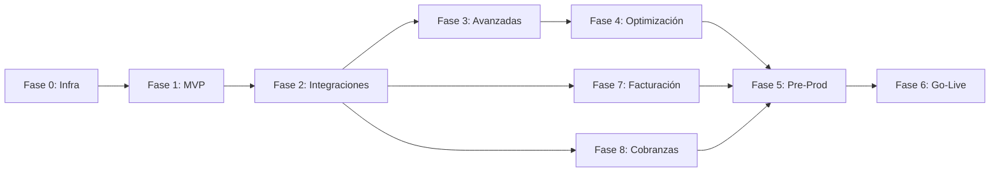

# Plan de Trabajo - Plataforma de Administración de Alquileres

---

## Resumen Ejecutivo

Este plan de trabajo detalla la implementación completa de la Plataforma de Administración de Alquileres, basándose en:
- **Documento de Requerimientos Funcionales (DRF)**
- **Documento de Arquitectura Técnica (DAT)**
- **Diagramas C4** (Contexto, Contenedores, Componentes, Código)
- **Modelo de Datos (ERD)**
- **Diagramas de Secuencia**

El proyecto se divide en **9 fases principales**:
- Fases 0-6: Core de la plataforma
- Fase 7: Sistema de Facturación por Lotes
- Fase 8: Sistema de Cobranzas y Liquidaciones

---

## Fase 0: Preparación e Infraestructura ✅ COMPLETADA

### Objetivo
Establecer la base técnica y organizativa del proyecto.

### Tareas

#### 0.1 Configuración del Proyecto
- ✅ **T001**: Crear repositorios Git (frontend, backend, infrastructure)
  - Estructura de mono-repo
  - Configuración de ramas (main, develop, feature/*)
  - Políticas de commits y PR
  
- ✅ **T002**: Configurar herramientas de gestión de proyecto
  - GitHub Projects
  - Tableros Kanban
  - Definir workflow de tareas

- ✅ **T003**: Establecer estándares de código
  - Guías de estilo (ESLint, Prettier)
  - Convenciones de nombrado
  - Documentación de código

#### 0.2 Infraestructura Base (IaC)

- ✅ **T021**: Configurar entorno de desarrollo local
  - Docker Compose para servicios locales
  - PostgreSQL + Redis + RabbitMQ + MinIO
  - Scripts de inicialización

- ⏸️ **T022**: Crear infraestructura cloud con Terraform (SUSPENDIDO)
  - VPC, subnets, security groups
  - RDS PostgreSQL (staging + prod)
  - ElastiCache Redis
  - S3 buckets para documentos
  - SQS/RabbitMQ para mensajería
  
- ⏸️ **T023**: Configurar Kubernetes (EKS/GKE/AKS) (SUSPENDIDO)
  - Cluster staging y production
  - Namespaces por entorno
  - Ingress controller
  - Helm charts base

#### 0.3 CI/CD Pipeline

- ✅ **T031**: Configurar GitHub Actions
  - Pipeline de build
  - Tests unitarios automáticos
  - Análisis de código (SonarQube)
  - Build y push de imágenes Docker

- ✅ **T032**: Implementar CD con Ansible
  - Deploy automático
  - Playbooks de deployment
  - Configuración de inventarios

#### 0.4 Observabilidad

- **T041**: Implementar stack de logging
  - Fluentd/Logstash → Elasticsearch
  - Kibana para visualización
  - Configurar índices y retención

- ⏸️ **T042**: Configurar métricas y monitoreo (SUSPENDIDO)
  - Prometheus para métricas
  - Grafana dashboards
  - Alertas básicas (CPU, memoria, disco)

**Criterios de Éxito**:
- ✅ Pipeline CI/CD funcional
- ✅ Entorno local de desarrollo documentado
- ⏳ Infraestructura cloud operativa (staging)
- ⏳ Logs y métricas básicas funcionando

---

## Fase 1: MVP - Core Business ✅ COMPLETADA

### Objetivo
Implementar la funcionalidad mínima viable con los módulos core del negocio.

### 1.1 Backend Core - Autenticación y Usuarios

- ✅ **T111**: Diseño e implementación del modelo de datos core
  - Migrations de PostgreSQL
  - Entidades: User, Role, Permission
  - Índices y constraints

- ✅ **T112**: Módulo de Autenticación
  - Registro de usuarios
  - Login con JWT
  - Refresh tokens
  - Recuperación de contraseña
  - Tests unitarios e integración

- ✅ **T113**: Sistema RBAC (Control de Acceso)
  - Definición de roles y permisos
  - Guards y decorators
  - Middleware de autorización
  - Tests de autorización

- ✅ **T114**: API de gestión de usuarios
  - CRUD de usuarios
  - Cambio de contraseña
  - Perfil de usuario
  - Validaciones

### 1.2 Backend Core - Propiedades

- ✅ **T121**: Modelo de datos de propiedades
  - Entidades: Property, Unit, PropertyFeature
  - Tipos de propiedades
  - Migrations y seeds de prueba

- ✅ **T123**: API de Propiedades
  - CRUD de propiedades
  - Gestión de unidades
  - Búsqueda y filtros
  - Validaciones de negocio

- ✅ **T124**: Gestión de imágenes y documentos
  - Upload a S3/MinIO con pre-signed URLs
  - Asociación con propiedades
  - Límites de tamaño y formatos

### 1.3 Backend Core - Inquilinos

- ✅ **T131**: Modelo de datos de inquilinos
  - Entidad Tenant con datos personales
  - Documentos de identidad
  - Historial y referencias

- ✅ **T132**: API de Inquilinos
  - CRUD de inquilinos
  - Búsqueda por nombre/documento
  - Historial de pagos (vista)

### 1.4 Backend Core - Contratos (Leases)

- ✅ **T141**: Modelo de datos de contratos
  - Entidades: Lease, LeaseAmendment
  - Estados del contrato
  - Cláusulas y condiciones
  - Migrations

- ✅ **T142**: API de Contratos
  - Crear contrato (draft)
  - Activar contrato
  - Renovar contrato
  - Terminar contrato
  - Enmiendas al contrato

- ✅ **T143**: Generación de documentos PDF (contratos)
  - Integración con PDFKit
  - Templates de contrato
  - Variables dinámicas
  - API para descargar contrato

### 1.5 Frontend Base - Portal Web

- ✅ **T151**: Setup del proyecto frontend
  - Next.js + React
  - Tailwind CSS
  - Estructura de carpetas
  - Routing

- ✅ **T152**: Sistema de autenticación frontend
  - Páginas de login/registro
  - Manejo de tokens
  - Rutas protegidas
  - Refresh token automático

- ✅ **T153**: Layout y navegación principal
  - ✅ Header con menú
  - ✅ Sidebar de navegación
  - ✅ Breadcrumbs
  - ✅ Responsive design

- ✅ **T154**: Módulo de Propiedades (UI)
  - Lista de propiedades
  - Detalle de propiedad
  - Formulario crear/editar
  - Upload de imágenes
  - Integración con API

- ✅ **T155**: Módulo de Inquilinos (UI)
  - Lista de inquilinos
  - Detalle de inquilino
  - Formulario crear/editar
  - Búsqueda y filtros

- ✅ **T156**: Módulo de Contratos (UI)
  - Lista de contratos
  - Detalle de contrato
  - Wizard de creación
  - Previsualización de PDF
  - Estados y alertas

### 1.6 Base de Datos y Seeds

- ✅ **T161**: Scripts de seeds de datos de prueba
  - Usuarios de diferentes roles
  - Propiedades de ejemplo
  - Inquilinos de prueba
  - Contratos activos y vencidos

### 1.7 Testing MVP

- ✅ **T171**: Tests unitarios backend (70% coverage)
  - Tests de servicios
  - Tests de controladores
  - Tests de autenticación/autorización

- ✅ **T172**: Tests de integración API
  - Tests end-to-end de flujos principales
  - Tests de creación de propiedad
  - Tests de creación de contrato

- ✅ **T173**: Tests E2E frontend críticos
  - Login flow
  - Crear propiedad
  - Crear inquilino
  - Crear contrato
  - Flujos de facturas
  - Flujos de pagos
  - Playwright

**Criterios de Éxito**:
- ✅ Usuarios pueden autenticarse
- ✅ CRUD completo de Propiedades, Inquilinos y Contratos
- ✅ Generación básica de PDF de contrato
- ✅ Portal web funcional con navegación
- ✅ Tests con >70% coverage

---

## Fase 2: Integraciones Externas (EN PROGRESO)

### Objetivo
Integrar servicios externos críticos para el negocio.

### 2.1 Módulo de Pagos Básico

- ✅ **T211**: Modelo de datos de pagos
  - Entidades: Payment, Invoice, TenantAccount, TenantAccountMovement
  - Estados de pago
  - Métodos de pago
  - Migrations

- ⏸️ **T212**: Integración con Stripe (SUSPENDIDO)
  - Configuración de cuenta Stripe
  - Implementar Strategy pattern para PSPs
  - Crear payment intents
  - Webhooks de confirmación
  - Manejo de errores y reintentos

- **T213**: Integración con MercadoPago
  - Implementación de Strategy para MP
  - Checkout Pro
  - Webhooks IPN
  - Testing en sandbox

- ✅ **T214**: API de Pagos
  - Registrar pago manual
  - Consultar estado de pago
  - Historial de pagos
  - Cuenta corriente de inquilinos

- ✅ **T215**: Generación de facturas/recibos PDF
  - Template de factura/recibo
  - Numeración automática
  - API para descargar

### 2.2 Firma Digital

- **T221**: Integración con DocuSign
  - Configuración de cuenta
  - API de creación de sobres
  - Envío de documentos para firma
  - Webhook de firma completada
  - Descarga de documento firmado

- **T222**: Flujo de firma de contrato
  - Generar PDF de contrato
  - Enviar para firma
  - Actualizar estado cuando se firma
  - Notificaciones a las partes

### 2.3 Notificaciones

- **T231**: Servicio de notificaciones
  - Abstraer NotificationService
  - Plantillas de mensajes de WhatsApp
  - Sistema de cola para notificaciones

- **T232**: Integración con WhatsApp Cloud API (Email)
  - Configuración de API key
  - Templates en WhatsApp Cloud API
  - Envío de mensajes transaccionales por WhatsApp
  - Tracking de envíos

- **T233**: Integración con WhatsApp Cloud API (SMS)
  - Configuración de cuenta
  - Envío de SMS
  - Log de mensajes enviados

- **T234**: Push Notifications setup (Firebase)
  - Configuración básica
  - Registro de dispositivos
  - Envío de notificaciones (preparación para mobile)

### 2.4 UI Módulo de Pagos

- ✅ **T241**: Módulo de Pagos (Frontend)
  - Lista de pagos por contrato
  - Registrar pago manual
  - Visualizar recibo
  - Historial de transacciones

### 2.5 Testing Integraciones

- **T251**: Tests de integración con PSPs
  - Mocks de Stripe/MercadoPago
  - Tests de webhooks
  - Tests de errores de pago

- **T252**: Tests de notificaciones
  - Mocks de WhatsApp Cloud API
  - Verificar envío correcto
  - Templates rendering

**Criterios de Éxito**:
- ⏳ Pagos online funcionales con Stripe
- ⏳ Firma digital de contratos con DocuSign
- ⏳ Notificaciones por email y SMS operativas
- ✅ Generación automática de recibos

---

## Fase 3: Funcionalidades Avanzadas

### Objetivo
Completar módulos restantes y funcionalidades avanzadas.

### 3.1 CRM y Gestión Comercial

- **T311**: Modelo de datos CRM
- **T312**: API de CRM
- **T313**: UI de CRM

### 3.2 Mantenimiento

- **T321**: Modelo de datos de mantenimiento
- **T322**: API de Mantenimiento
- **T323**: UI de Mantenimiento

### 3.3 Reportes

- **T331**: Modelo de datos de reportes
- **T332**: Motor de generación de reportes
- **T333**: Reportes predefinidos
- **T334**: UI de Reportes

### 3.4 Portal de Propietarios

- **T341**: Portal específico para propietarios

### 3.5 Portal de Inquilinos

- **T351**: Portal específico para inquilinos

### 3.6 Mobile App (PWA básica)

- **T361**: Convertir web a PWA

### 3.7 Auditoría

- **T371**: Sistema de auditoría

### 3.8 Testing Fase 3

- **T381**: Tests de CRM, Mantenimiento, Reportes
- **T382**: Tests E2E de flujos completos

---

## Fase 4: Optimización y Escalamiento

### Objetivo
Mejorar performance, escalabilidad y experiencia de usuario.

### 4.1 Performance y Caching
- **T411**: Implementar caché con Redis
- **T412**: Optimización de queries DB
- **T413**: Implementar paginación eficiente

### 4.2 Búsqueda Avanzada
- **T421**: Integración con Elasticsearch
- **T422**: UI de búsqueda avanzada

### 4.3 Workers Asíncronos
- **T431**: Implementar workers para tareas pesadas
- **T432**: Cobros recurrentes automáticos

### 4.4 Mejoras de UX
- **T441**: Dashboards interactivos
- **T442**: Notificaciones en tiempo real

### 4.5 Seguridad Avanzada
- **T451**: Implementar 2FA
- **T452**: Rate limiting y throttling
- **T453**: Security headers y WAF básico

### 4.6 Testing y Load Testing
- **T461**: Load testing con k6/Gatling
- **T462**: Security testing básico

---

## Fase 5: Preparación para Producción

### Objetivo
Endurecer el sistema para producción y establecer procesos operativos.

### 5.1 Hardening de Seguridad
- **T511**: Auditoría de seguridad completa
- **T512**: Gestión de secrets con Vault
- **T513**: Backups automatizados

### 5.2 Documentación
- **T521**: Documentación técnica completa
- **T522**: Documentación de API (OpenAPI/Swagger)
- **T523**: Manual de usuario

### 5.3 Monitoreo y Alertas
- **T531**: Configurar alertas de producción
- **T532**: Dashboards de producción

### 5.4 Disaster Recovery
- **T541**: Plan de DR y tests

### 5.5 Ambiente de Producción
- **T551**: Configurar ambiente de producción
- **T552**: Pipeline de CD a producción

### 5.6 UAT
- **T561**: Sesiones de UAT con usuarios reales

### 5.7 Capacitación
- **T571**: Capacitación a usuarios

---

## Fase 6: Go-Live y Estabilización

### Objetivo
Lanzar a producción y estabilizar el sistema.

### 6.1 Migración de Datos
- **T611**: Scripts de migración de datos existentes

### 6.2 Go-Live
- **T621**: Deployment a producción
- **T622**: Comunicación de lanzamiento

### 6.3 Estabilización
- **T631**: Monitoreo y corrección de bugs críticos
- **T632**: Optimizaciones post-lanzamiento

### 6.4 Retrospectiva
- **T641**: Retrospectiva del proyecto
- **T642**: Plan de roadmap futuro

---

## Fase 7: Sistema de Facturación por Lotes ✅ COMPLETADA

> **Especificación Técnica**: Ver [billing.md](./technical/billing.md)

### Objetivo
Implementar sistema de facturación automatizada ejecutado por crontab.

### 7.1 Infraestructura Batch

- ✅ **T711**: Setup proyecto `/batch`
  - Proyecto Node.js CLI independiente
  - Estructura de carpetas (commands, services, shared)
  - Configuración TypeScript
  - Logger (Winston)

- ✅ **T712**: Conexión a base de datos compartida
  - Pool de conexiones PostgreSQL
  - Manejo de transacciones
  - Variables de entorno

### 7.2 Modelo de Datos Facturación

- ✅ **T721**: Migraciones para ajustes por inflación
  - Campos en `leases`: adjustment_index, adjustment_month, etc.
  - Tabla `inflation_indices` (ICL, IGP-M)
  - Tabla `exchange_rates` (USD, BRL → ARS)

- **T722**: Migraciones para ARCA/factura electrónica
  - Campos en `companies`: arca_cuit, arca_certificate, etc.
  - Campos en `invoices`: arca_cae, arca_qr_data, etc.
  - Campos para retenciones (IIBB, IVA, Ganancias)

- ✅ **T723**: Migraciones para reportes
  - Tabla `billing_jobs` (auditoría)

### 7.3 Servicios de Índices

- ✅ **T731**: Servicio BCRA (Argentina)
  - API de índices (ICL - variable 41)
  - API de tipos de cambio (USD, BRL)
  - Cache de valores diarios
  - Manejo de errores y reintentos

- ✅ **T732**: Servicio BCB/FGV (Brasil)
  - API de IGP-M
  - Parsing de respuestas
  - Sincronización diaria

### 7.4 Multi-Moneda

- ✅ **T741**: Servicio de tipos de cambio
  - ExchangeRateService
  - Cache en base de datos
  - Conversión USD/BRL → ARS

- ✅ **T742**: Lógica de facturación multi-moneda
  - Contratos en USD/BRL
  - Conversión al facturar
  - Guardar monto original y convertido

### 7.5 Billing Core

- ✅ **T751**: Servicio de ajustes
  - AdjustmentService
  - Cálculo por índice (ICL, IGP-M)
  - Cláusulas de aumento personalizadas
  - Actualización de monto de alquiler

- ✅ **T752**: Comando `billing`
  - Generar facturas según frecuencia
  - Aplicar ajustes si corresponde
  - Cargar a cuenta corriente
  - Opción --dry-run

- ✅ **T753**: Comando `overdue`
  - Marcar facturas vencidas
  - Cambiar estado invoice.status

- ✅ **T754**: Comando `late-fees`
  - Calcular intereses por mora
  - Crear movimiento en cuenta corriente
  - Notificar al inquilino

- ✅ **T755**: Comando `reminders`
  - Enviar recordatorios N días antes
  - Respetar preferencias de notificación

### 7.6 Integración ARCA (ex AFIP)

- ✅ **T761**: Servicio ARCA
  - Autenticación WSAA (LoginCMS)
  - Emisión de factura (FECAESolicitar)
  - Manejo de token y sign
  - Generación de QR

- ✅ **T762**: Cálculo de retenciones
  - WithholdingsService
  - IIBB, IVA, Ganancias
  - Según configuración de company

### 7.7 Notificaciones Facturación

- ✅ **T771**: Templates de email facturación
  - Factura emitida (Handlebars)
  - Recordatorio de pago
  - Aviso de mora

- ✅ **T772**: Comando `sync-indices`
  - Sincronizar ICL, IGP-M diariamente
  - Guardar en inflation_indices

- ✅ **T773**: Comando `sync-rates`
  - Sincronizar tipos de cambio
  - Guardar en exchange_rates

### 7.8 Reportes Automáticos

- ✅ **T781**: Servicio de reportes
  - ReportService
  - Generación de PDF (Puppeteer)
  - Templates Handlebars

- ✅ **T782**: Comando `reports`
  - Generar reportes programados
  - Envío por email
  - Resumen mensual propietarios

### 7.9 Testing Facturación

- ✅ **T791**: Tests unitarios servicios
  - Tests de AdjustmentService
  - Tests de BillingService
  - Mocks de APIs externas

- **T792**: Tests de integración
  - Flujo completo de facturación
  - Tests de ARCA en sandbox
  - Tests de notificaciones

**Criterios de Éxito**:
- ✅ Facturas se generan automáticamente por crontab
- ✅ Ajustes por ICL/IGP-M aplican correctamente
- ✅ Multi-moneda funciona (USD, BRL → ARS)
- ⏳ ARCA emite CAE correctamente
- ✅ Retenciones calculadas para agentes
- ✅ Reportes mensuales se envían a propietarios

### Configuración Crontab (Fase 7)

```bash
# Sincronizar índices (diario 6:00)
0 6 * * * cd /opt/rent/batch && npm start -- sync-indices

# Sincronizar tipos de cambio (diario 6:30)
30 6 * * * cd /opt/rent/batch && npm start -- sync-rates

# Facturación (diario 7:00)
0 7 * * * cd /opt/rent/batch && npm start -- billing

# Marcar vencidas (diario 8:00)
0 8 * * * cd /opt/rent/batch && npm start -- overdue

# Cargos por mora (diario 8:30)
30 8 * * * cd /opt/rent/batch && npm start -- late-fees

# Recordatorios (diario 9:00)
0 9 * * * cd /opt/rent/batch && npm start -- reminders

# Reportes mensuales (día 1, 10:00)
0 10 1 * * cd /opt/rent/batch && npm start -- reports --type monthly
```

---

## Fase 8: Sistema de Cobranzas y Liquidaciones

> **Especificación Técnica**: Ver [payments.md](./technical/payments.md)

### Objetivo
Implementar sistema de cobranza multicanal y liquidación a propietarios.

### 8.1 Modelo de Datos Cobranzas

- ✅ **T811**: Migraciones cuentas bancarias
  - Tabla `bank_accounts` (CBU/CVU)
  - Alias virtuales por propiedad
  - Cuentas de propietarios

- ✅ **T812**: Migraciones crypto
  - Tabla `crypto_wallets`
  - Tabla `lightning_invoices`
  - Hot/cold wallet flags

- ✅ **T813**: Migraciones pagos y liquidaciones
  - Tabla `payments` (extendida)
  - Tabla `receipts`

- ✅ **T814**: Migraciones conciliación
  - Tabla `tenant_accounts` (cuenta corriente)
  - Tabla `tenant_account_movements`

### 8.2 Integración MercadoPago

- **T821**: Servicio MercadoPago
  - MercadoPagoService
  - Crear preferencia de pago
  - Webhooks IPN
  - Testing sandbox

- **T822**: Link de pago en facturas
  - Incluir link MP en email de factura
  - QR code en PDF de factura

### 8.3 Integración Bancaria

- **T831**: Servicio de transferencias
  - BankTransferService
  - Integración con proveedor (Bind/Pomelo)
  - Webhooks de movimientos

- **T832**: Cuentas virtuales por propiedad
  - Crear alias virtual
  - Asociar a propiedad
  - Identificación automática

### 8.4 Integración Crypto

- **T841**: Servicio de wallets crypto
  - WalletService
  - Derivación de direcciones HD (Bitcoin)
  - Smart contract Ethereum

- **T842**: Lightning Network
  - Generación de invoices
  - Verificación de pagos
  - Integración con LND

- **T843**: Verificación de confirmaciones
  - Bitcoin: 3 confirmaciones
  - Ethereum: 12 confirmaciones
  - Actualizar estado de pago

### 8.5 Conciliación

- **T851**: Servicio de conciliación
  - ReconciliationService
  - Matching por alias
  - Matching por monto/fecha
  - Alertas de no conciliados

- **T852**: Comando `reconcile-bank`
  - Procesar movimientos bancarios
  - Match con pagos pendientes
  - Generar alertas

### 8.6 Cuenta Corriente

- ✅ **T861**: Servicio de cuenta corriente
  - TenantAccountService
  - Aplicación FIFO de pagos
  - Cálculo de balance

- **T862**: Comando `process-payments`
  - Procesar webhooks pendientes
  - Confirmar pagos

### 8.7 Recibos

- ✅ **T871**: Servicio de recibos
  - ReceiptService
  - Generación de PDF
  - Numeración automática

- **T872**: Comando `send-receipts`
  - Enviar recibos pendientes
  - Mensaje de WhatsApp con referencia al PDF

### 8.8 Liquidaciones

- ✅ **T881**: Servicio de liquidaciones
  - SettlementService
  - Cálculo de comisión (% o fijo)
  - Descuento de retenciones
  - Programación según vencimiento

- ✅ **T882**: Comando `process-settlements`
  - Procesar liquidaciones programadas
  - Transferir fondos
  - Notificar a propietario

- ✅ **T883**: Lógica de fecha de liquidación
  - Si pago antes de vencimiento → liquidar en vencimiento
  - Si pago después → liquidar mismo día

### 8.9 Testing Cobranzas

- **T891**: Tests unitarios servicios
  - Tests de PaymentService
  - Tests de SettlementService
  - Mocks de MercadoPago/bancos

- **T892**: Tests de integración
  - Flujo completo de pago
  - Conciliación
  - Liquidación

**Criterios de Éxito**:
- ⏳ Pagos MP se confirman automáticamente
- ⏳ Transferencias bancarias se concilian <24h
- ✅ Recibos se envían automáticamente
- ✅ Liquidaciones respetan fecha de vencimiento
- ✅ Propietarios reciben notificación de liquidación

### Configuración Crontab (Fase 8)

```bash
# Procesar webhooks (cada 5 min)
*/5 * * * * cd /opt/rent/batch && npm start -- process-payments

# Conciliación bancaria (diario 8:00)
0 8 * * * cd /opt/rent/batch && npm start -- reconcile-bank

# Verificar crypto (cada 15 min)
*/15 * * * * cd /opt/rent/batch && npm start -- check-crypto

# Liquidaciones (diario 10:00)
0 10 * * * cd /opt/rent/batch && npm start -- process-settlements

# Recibos pendientes (cada hora)
0 * * * * cd /opt/rent/batch && npm start -- send-receipts
```

---

## Resumen de Estado por Fase

| Fase | Descripción | Estado |
|------|-------------|--------|
| **Fase 0** | Preparación e Infraestructura | ✅ Completada |
| **Fase 1** | MVP Core Business | ✅ Completada |
| **Fase 2** | Integraciones Externas | 🔄 En Progreso |
| **Fase 3** | Funcionalidades Avanzadas | ⏳ Pendiente |
| **Fase 4** | Optimización y Escalamiento | ⏳ Pendiente |
| **Fase 5** | Preparación para Producción | ⏳ Pendiente |
| **Fase 6** | Go-Live y Estabilización | ⏳ Pendiente |
| **Fase 7** | Sistema de Facturación por Lotes | ✅ Completada |
| **Fase 8** | Sistema de Cobranzas y Liquidaciones | 🔄 En Progreso |

---

## Diagrama de Dependencias entre Fases



---

## Riesgos y Mitigaciones

| Riesgo | Probabilidad | Impacto | Mitigación |
|--------|--------------|---------|------------|
| Complejidad de integraciones externas | Alta | Alto | Sandboxes, fallbacks, empezar temprano |
| Cambios en requerimientos | Media | Alto | Metodología ágil, sprints cortos |
| API BCRA/BCB no disponible | Media | Medio | Cache de índices, reintentos |
| Cambios en ARCA/AFIP | Media | Alto | Abstracción de servicios |
| Pagos no conciliados | Media | Medio | Alertas, revisión manual diaria |
| Volatilidad crypto | Baja | Medio | Conversión inmediata a stablecoin |
| Webhook perdido | Baja | Alto | Polling de respaldo, idempotencia |
| Fuga de datos / seguridad | Baja | Crítico | Auditorías, pentesting |

---

## Hitos Clave (Milestones)

| # | Hito | Fin de Fase | Estado |
|---|------|-------------|--------|
| M1 | Infraestructura base operativa | Fase 0 | ✅ |
| M2 | MVP funcional - Demo interno | Fase 1 | ✅ |
| M3 | Integraciones externas funcionando | Fase 2 | 🔄 |
| M4 | Funcionalidades completas - Beta cerrada | Fase 3 | ⏳ |
| M5 | Sistema optimizado - Beta pública | Fase 4 | ⏳ |
| M6 | UAT aprobado - Pre-producción | Fase 5 | ⏳ |
| M7 | Go-Live - Producción | Fase 6 | ⏳ |
| M8 | Facturación automatizada operativa | Fase 7 | ✅ |
| M9 | Cobranzas y liquidaciones operativas | Fase 8 | 🔄 |

---

## Features Futuras (Post-Implementación)

| Feature | Descripción |
|---------|-------------|
| **Facturación electrónica Brasil** | NF-e para operaciones en Brasil |
| **Stripe** | Tarjetas internacionales |
| **PayPal** | Pagos desde exterior |
| **Wise** | Liquidaciones internacionales |
| **Fireblocks** | Custody crypto enterprise |
| **Portal inquilino** | Ver estado de cuenta, pagar online |
| **App móvil nativa** | React Native o Flutter |
| **IA para pricing** | ML para sugerir rentas óptimas |
| **Integración IoT** | Sensores para mantenimiento preventivo |
| **Dashboard BI avanzado** | Análisis predictivo y tendencias |
