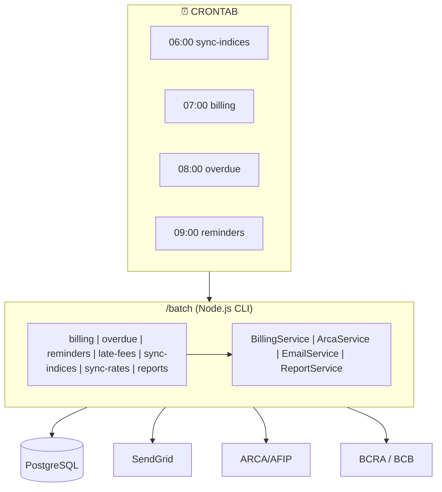

# Plan de Implementación: Sistema de Facturación por Lotes

> **Estado**: ✅ Implementación Completa (Fases 3-10)

---

## 1. Resumen Ejecutivo

Sistema de facturación automatizada por lotes que:

- Se ejecuta como **proyecto independiente** en `/batch` (separado del backend)
- Es invocado periódicamente por **crontab** (externo a la aplicación)
- Genera facturas automáticamente según la frecuencia de pago de cada contrato
- Aplica **ajustes por inflación** (ICL para Argentina, IGP-M para Brasil)
- Soporta **cláusulas de aumento** personalizadas en contratos
- Carga las facturas a la cuenta corriente del inquilino
- Soporta facturación electrónica **ARCA (ex AFIP)** para Argentina
- Maneja **retenciones** para compañías que son agentes de retención
- Envía notificaciones por email (facturas, recibos, recordatorios)
- Soporta **multi-moneda** (ARS, USD, BRL) con conversión automática
- Genera **reportes automáticos** mensuales para propietarios

---

## 2. Alcance

### 2.1 Funcionalidades Incluidas

| Módulo | Descripción | Estado |
|--------|-------------|--------|
| **Facturación Automática** | Generación de facturas según frecuencia del contrato | ✅ |
| **Ajustes por Inflación** | ICL (Argentina), IGP-M (Brasil) | ✅ |
| **Cláusulas de Aumento** | Porcentaje fijo, monto fijo, basado en índice | ✅ |
| **ARCA/AFIP** | Facturación electrónica Argentina | ✅ |
| **Retenciones** | IIBB, IVA, Ganancias para agentes de retención | ✅ |
| **Notificaciones** | Email de facturas, recordatorios, avisos de mora | ✅ |
| **Multi-Moneda** | Contratos en USD/BRL con conversión a moneda local | ✅ |
| **Reportes** | Resumen mensual, liquidación, estado de cuenta | ✅ |
| **Mora e Intereses** | Cálculo y aplicación automática de intereses | ✅ |

### 2.2 Fuera de Alcance (Fase 2)

- Conciliación bancaria automática
- Portal de pagos online (MercadoPago, etc.)
- Facturación electrónica Brasil (NF-e)
- App móvil para notificaciones push

---

## 3. Arquitectura

### 3.1 Diagrama de Componentes



### 3.2 Estructura del Proyecto

```
/batch
├── src/
│   ├── index.ts              # CLI principal
│   ├── services/
│   │   ├── indices/          # BCRA, FGV
│   │   ├── adjustment.service.ts
│   │   ├── exchange-rate.service.ts
│   │   ├── billing.service.ts
│   │   ├── invoice.service.ts
│   │   ├── arca.service.ts
│   │   ├── withholdings.service.ts
│   │   ├── email.service.ts
│   │   └── report.service.ts
│   └── shared/               # Database, Logger
├── docs/
│   └── OPERATIONS.md
└── scripts/
    └── generate-all-reports.sh
```

---

## 4. Estado de Implementación

### Fases Completadas

| Fase | Descripción | Estado |
|------|-------------|--------|
| 1 | Infraestructura (`/batch`, CLI, Logger) | ✅ |
| 2 | Modelo de Datos (migraciones) | ✅ |
| 3 | Servicios de Índices (ICL, IGP-M) | ✅ |
| 4 | Multi-Moneda | ✅ |
| 5 | Billing Core | ✅ |
| 6 | ARCA (factura electrónica) | ✅ |
| 7 | Retenciones | ✅ |
| 8 | Notificaciones (SendGrid) | ✅ |
| 9 | Reportes PDF | ✅ |
| 10 | Testing & Deploy | ✅ |

### Comandos CLI Disponibles

| Comando | Descripción |
|---------|-------------|
| `billing` | Generar facturas |
| `overdue` | Marcar facturas vencidas |
| `late-fees` | Aplicar cargos por mora |
| `reminders` | Enviar recordatorios |
| `sync-indices` | Sincronizar ICL/IGP-M |
| `sync-rates` | Sincronizar tipos de cambio |
| `reports` | Generar reportes PDF |

---

## 5. Configuración de Crontab

```bash
# Sincronizar índices (diario 6:00)
0 6 * * * cd /opt/rent/batch && npm start -- sync-indices

# Sincronizar tipos de cambio (diario 6:30)
30 6 * * * cd /opt/rent/batch && npm start -- sync-rates

# Facturación (diario 7:00)
0 7 * * * cd /opt/rent/batch && npm start -- billing

# Marcar vencidas (diario 8:00)
0 8 * * * cd /opt/rent/batch && npm start -- overdue

# Cargos por mora (diario 8:30)
30 8 * * * cd /opt/rent/batch && npm start -- late-fees

# Recordatorios (diario 9:00)
0 9 * * * cd /opt/rent/batch && npm start -- reminders

# Reportes mensuales (día 1, 10:00)
0 10 1 * * cd /opt/rent/batch && ./scripts/generate-all-reports.sh
```

---

## 6. Variables de Entorno

```bash
# Database
DATABASE_HOST=localhost
DATABASE_PORT=5432
DATABASE_NAME=rent_db

# APIs Externas
BCRA_API_URL=https://api.bcra.gob.ar
BCB_API_URL=https://api.bcb.gov.br

# SendGrid
SENDGRID_API_KEY=SG.xxx
EMAIL_FROM=noreply@example.com

# Reportes
REPORTS_OUTPUT_DIR=./reports
```

---

## 7. Riesgos y Mitigaciones

| Riesgo | Mitigación |
|--------|------------|
| API BCRA/BCB no disponible | Cache de índices, reintentos |
| Cambios en ARCA/AFIP | Abstracción de servicios |
| Errores en cálculos | Tests exhaustivos, modo dry-run |
| Fallas en emails | Cola de reintentos |

---

## 8. Consideraciones Futuras (Fase 2)

- **Portal de pagos**: Link en emails para pago online (MercadoPago, Stripe)
- **Facturación electrónica Brasil**: NF-e para operaciones en Brasil
- **Notificaciones push**: App móvil con notificaciones en tiempo real
- **API de preferencias**: Endpoint backend para configurar notificaciones
