# Diagramas Técnicos del Sistema

Este documento contiene los diagramas arquitectónicos 

## 1. Contexto del Sistema (C4 Nivel 1)

### 1.1 Vista Simplificada - Actores Principales

Muestra los usuarios principales y el sistema central.

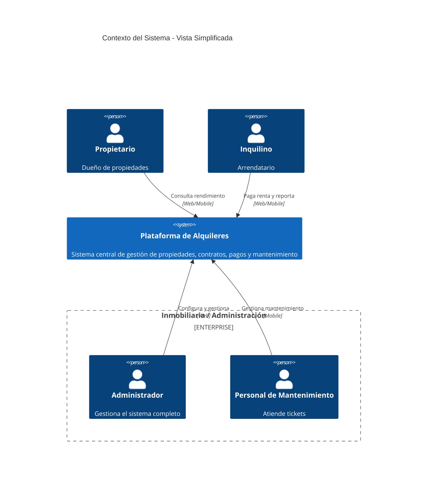

### 1.2 Vista Detallada - Integraciones Externas

Muestra todas las integraciones con sistemas externos.

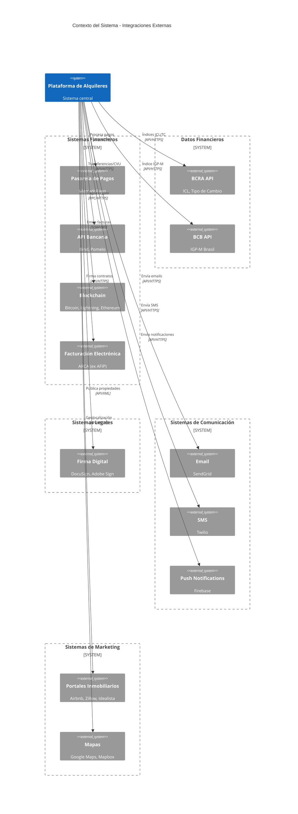

### 1.3 Vista Completa - Usuarios e Integraciones

Vista consolidada mostrando usuarios y sistemas externos.

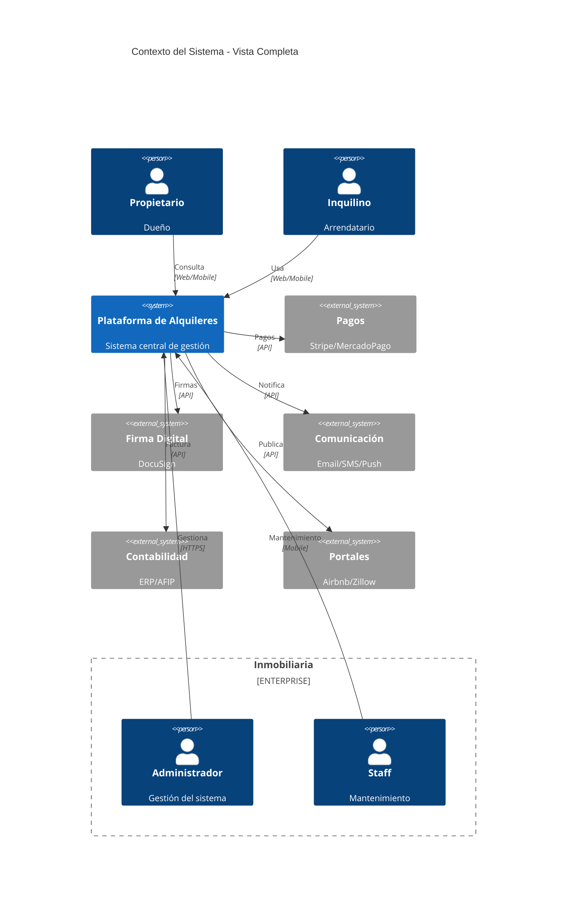

## 2. Contenedores (C4 Nivel 2)

Detalla la arquitectura interna del sistema, mostrando las aplicaciones, servicios y bases de datos.

### 2.1 Vista Frontend - Aplicaciones de Usuario

Muestra las aplicaciones frontend y su interacción con el API Gateway.

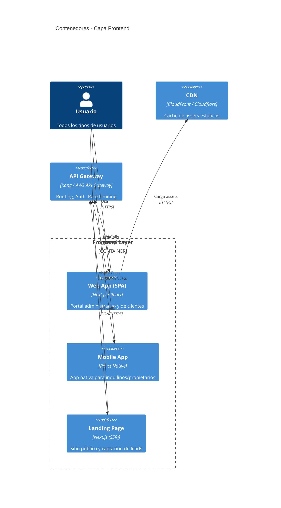

### 2.2 Vista Backend Core - Procesamiento

Muestra los servicios backend y su comunicación interna.

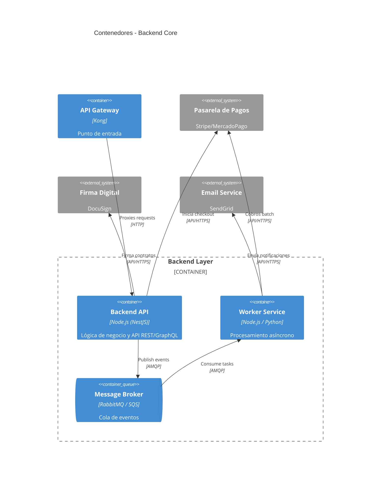

### 2.3 Vista Data Layer - Almacenamiento

Muestra las bases de datos y sistemas de almacenamiento.

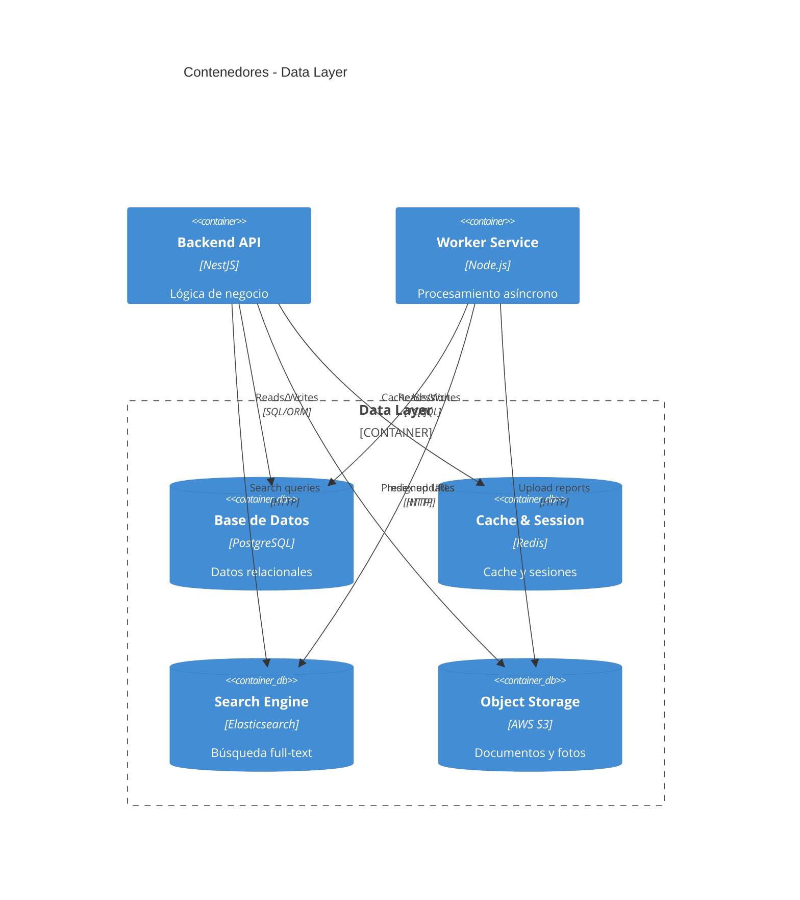

### 2.4 Vista Completa - Arquitectura General

Vista consolidada mostrando todas las capas y sus interacciones principales.

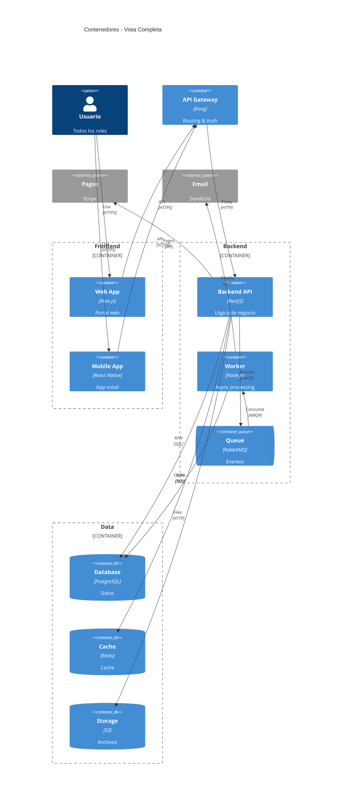

## 3. Componentes (C4 Nivel 3)

Detalle de los componentes internos del contenedor **Backend API**, organizados por dominio funcional.

### 3.1 Módulos Core Business (Auth, Property, Tenant, Lease)

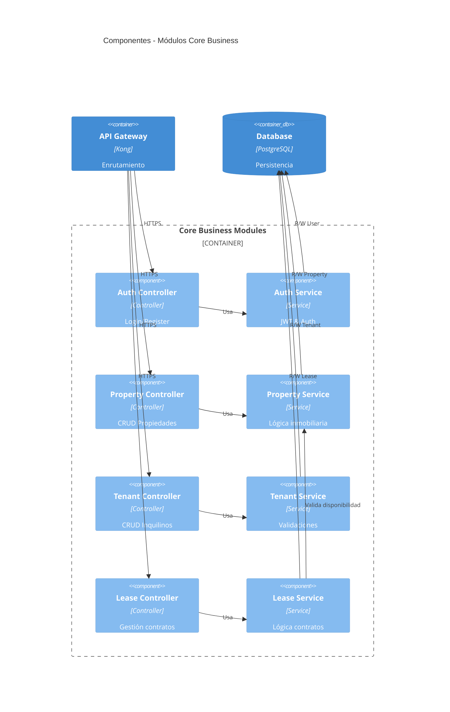

### 3.2 Módulos de Operaciones (Payment, CRM, Maintenance)

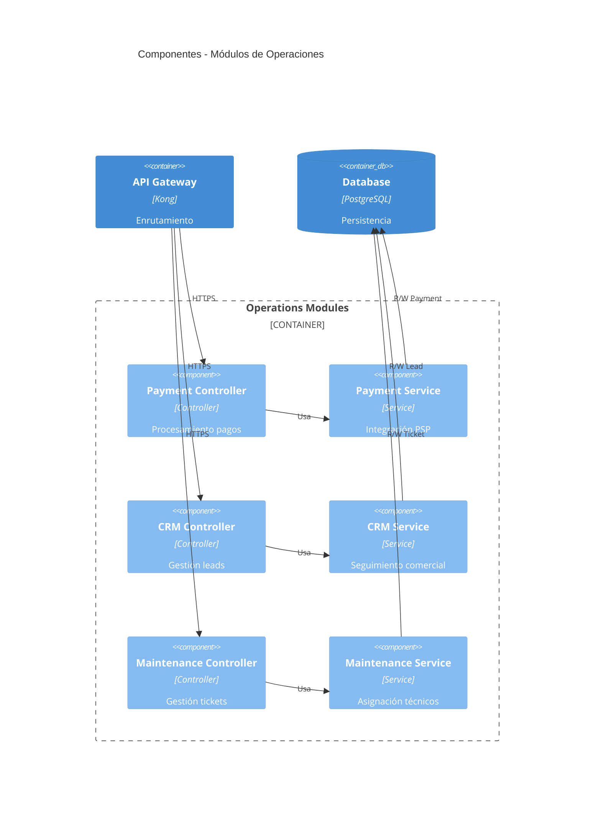

### 3.3 Módulos de Facturación y Cobranzas (Billing & Payments)

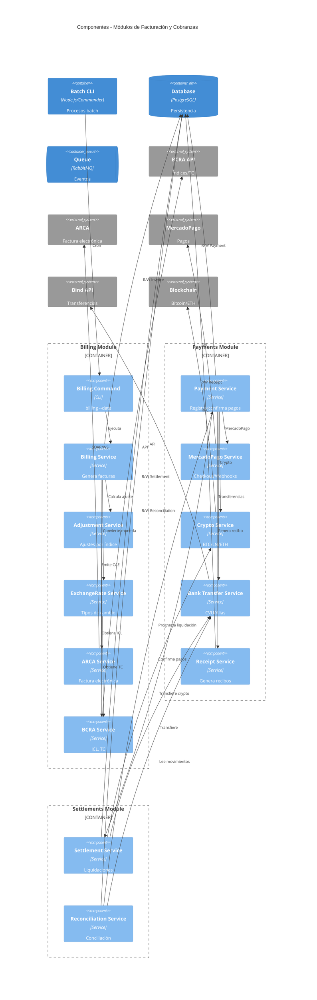

### 3.3 Módulos de Soporte (Reports, Notifications, Documents, Audit)

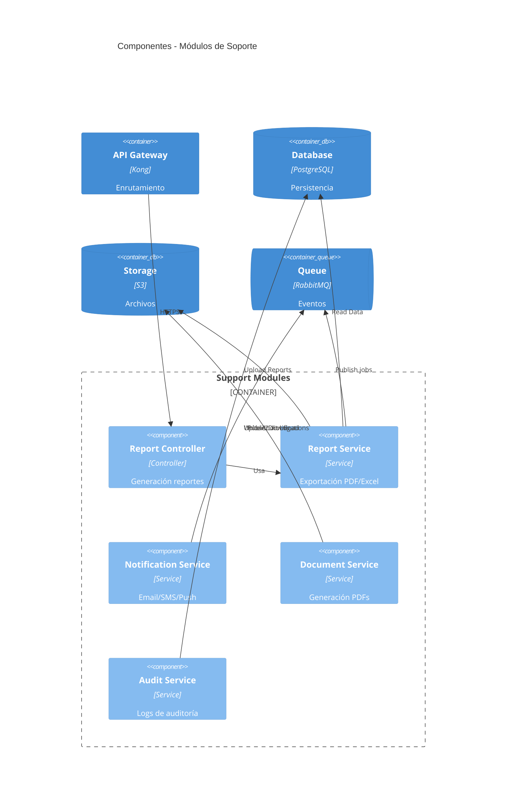

### 3.4 Integraciones entre Módulos

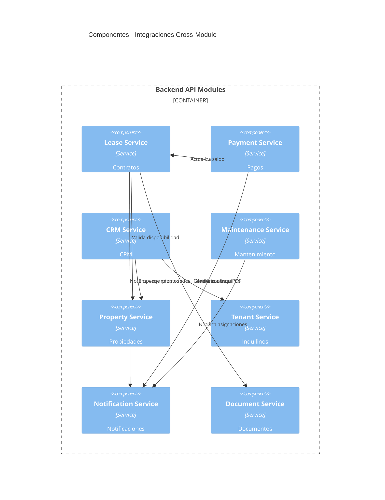

### 3.5 Vista Completa - Todos los Componentes

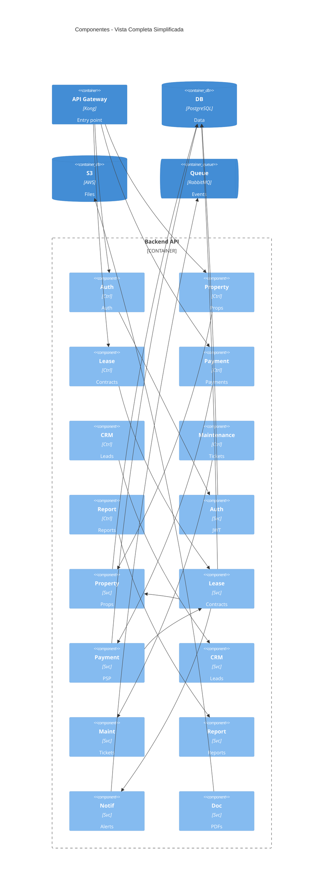

## 4. Código (C4 Nivel 4)

Detalle de clases principales para todos los módulos del Backend API, organizados por dominio funcional.

### 4.1 Módulos Core (Auth, Property, Tenant, Lease)

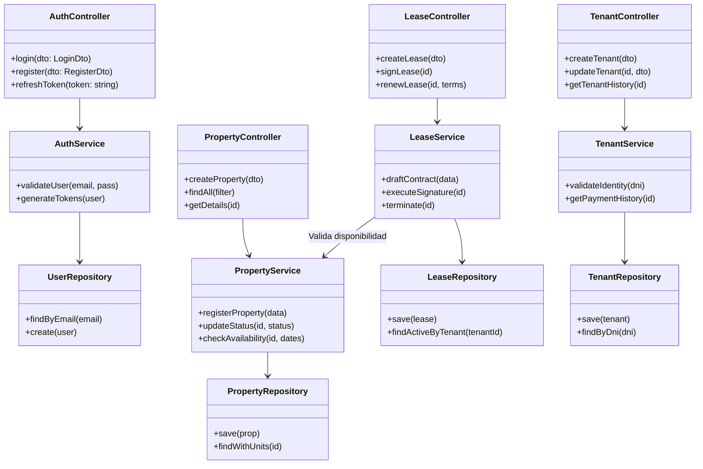

### 4.2 Módulo Financiero (Billing, Payments & Settlements)

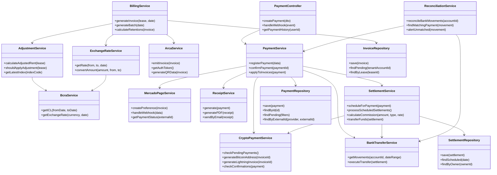

### 4.3 Módulos de Operaciones (CRM, Maintenance, Reports)

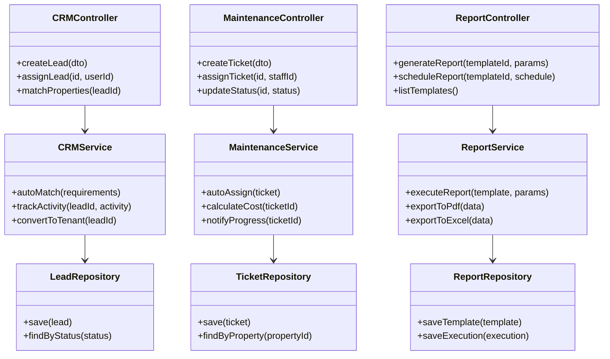

### 4.4 Módulos de Soporte (Notifications, Documents, Audit)

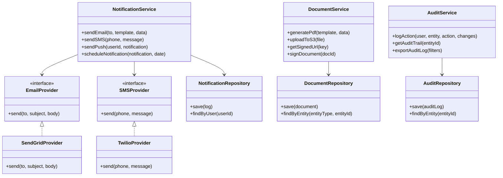

### 4.5 Integraciones entre Módulos

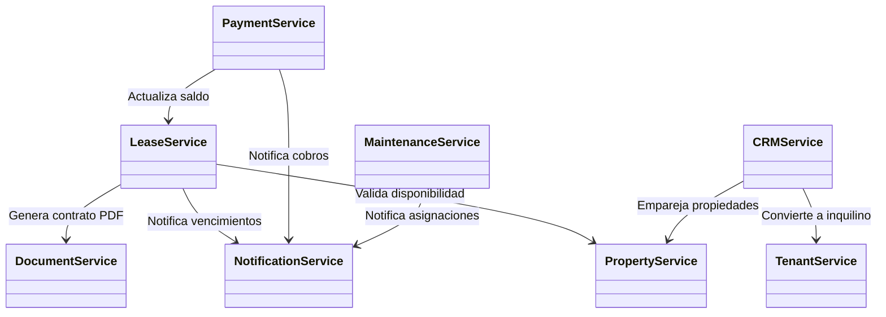

