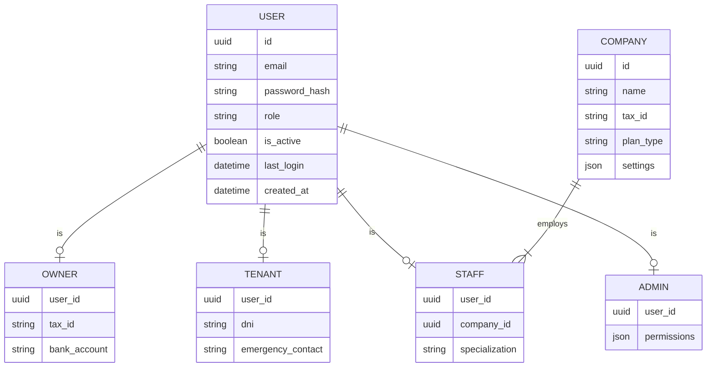
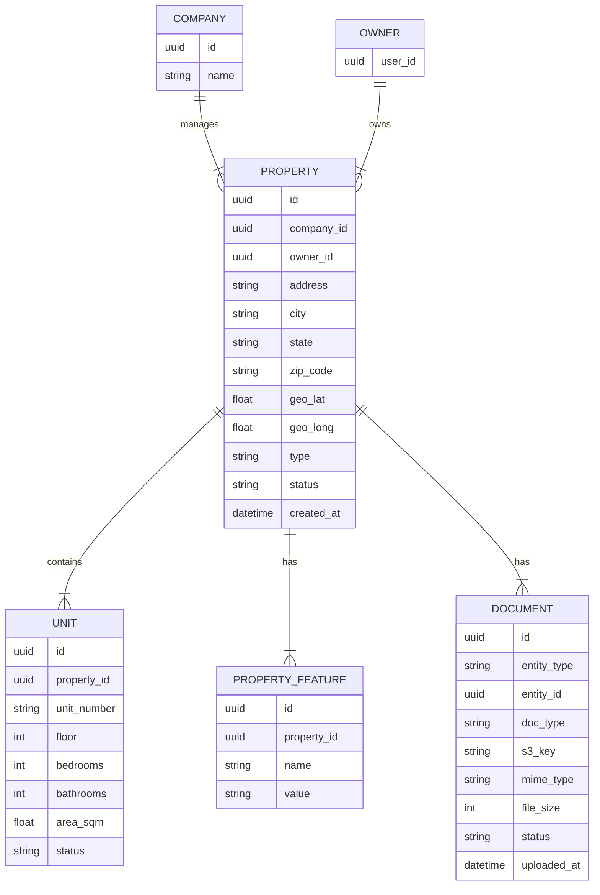
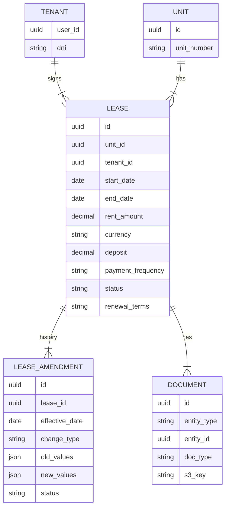
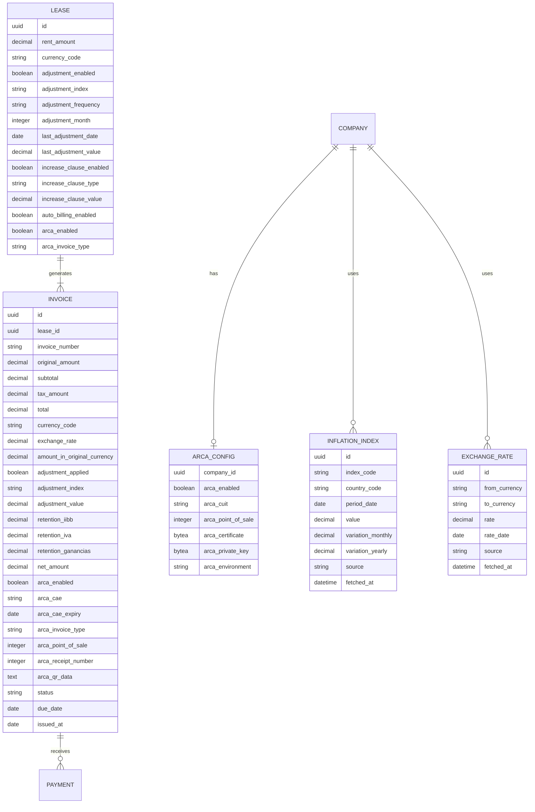
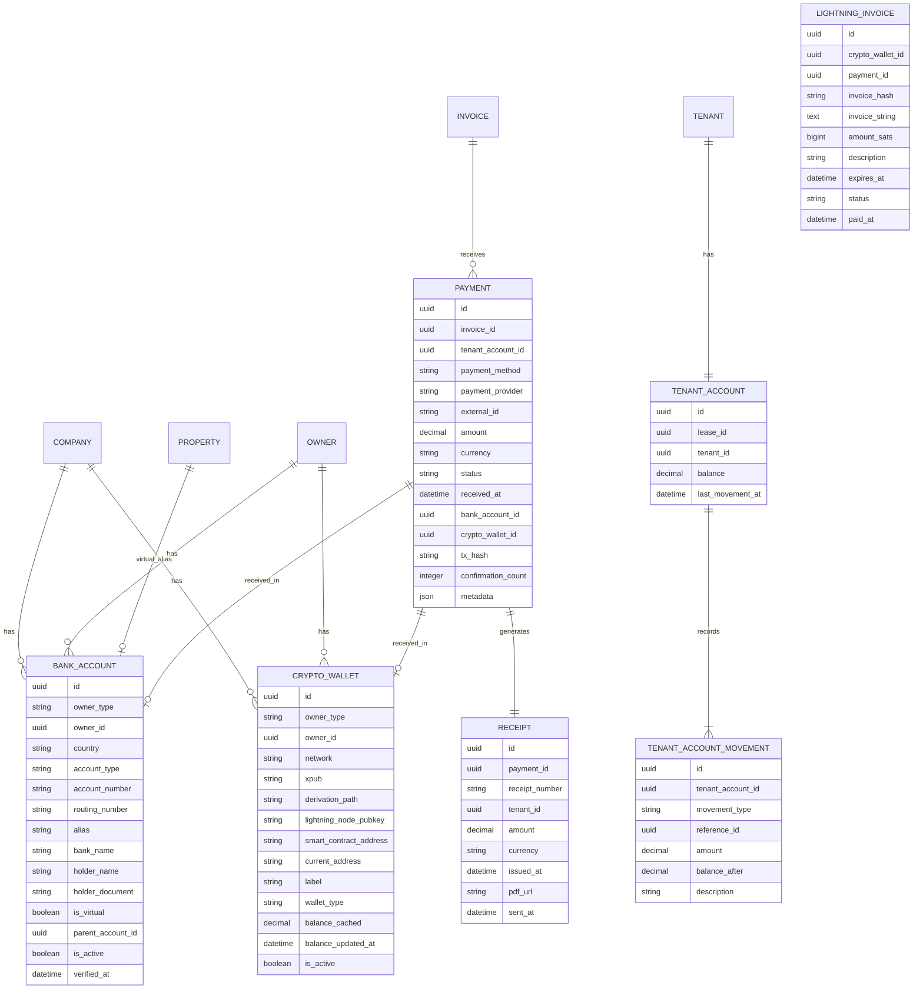
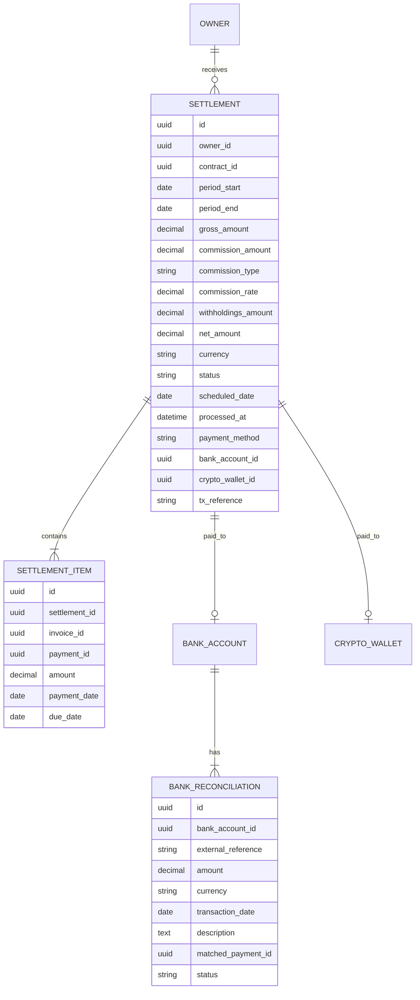
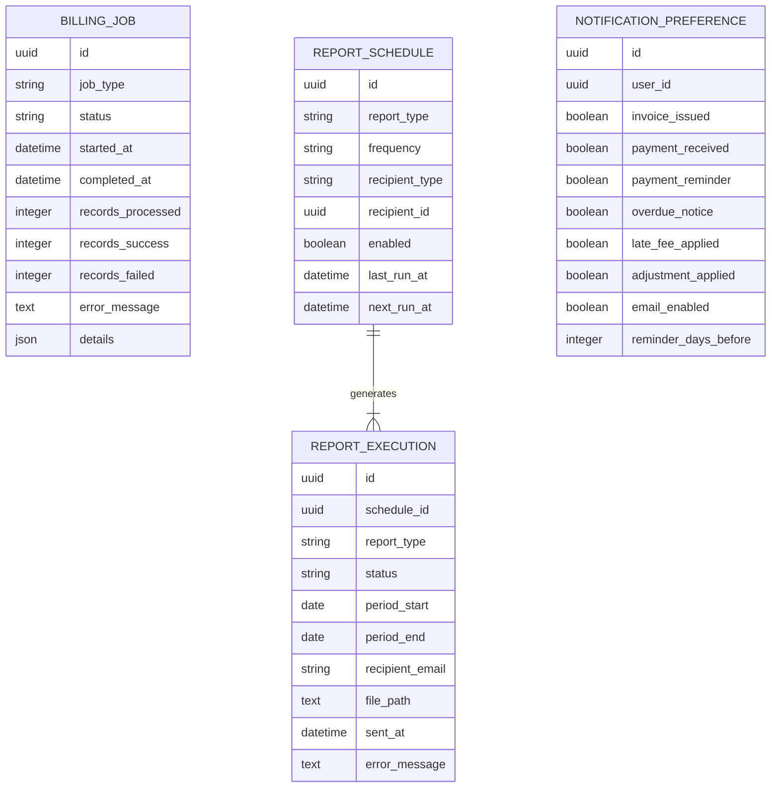
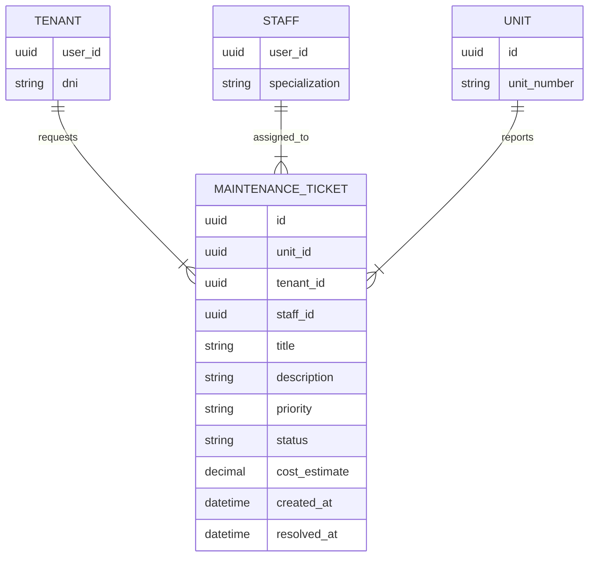
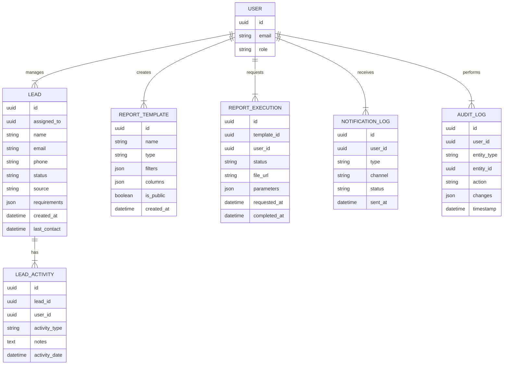
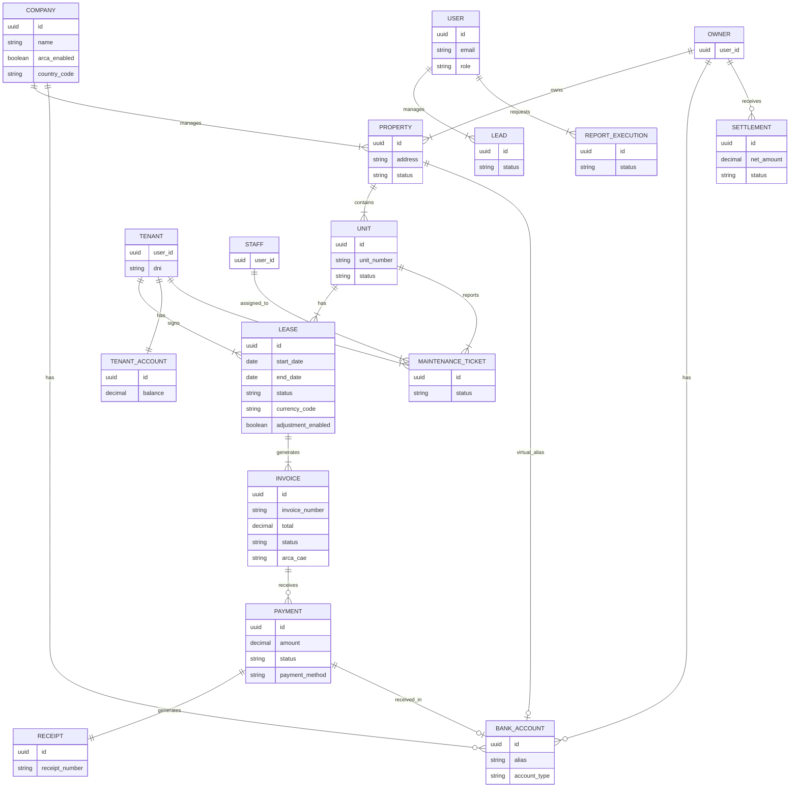

# Modelo de Datos (ERD)

Esquema conceptual de las entidades principales y sus relaciones, organizado por dominio funcional.

## 1. Dominio Core: Usuarios y Autenticación

## 2. Dominio de Propiedades

## 3. Dominio de Contratos (Leases)

## 4. Dominio Financiero (Billing, Payments & Invoicing)

### 4.1 Facturación e Índices

### 4.2 Cobranzas y Cuentas

### 4.3 Liquidaciones y Conciliación

### 4.4 Auditoría de Procesos Batch

## 5. Dominio de Operaciones (Maintenance)

## 6. Dominio de Sistema (CRM, Reports, Logs)

## 7. Vista Consolidada de Relaciones Principales

