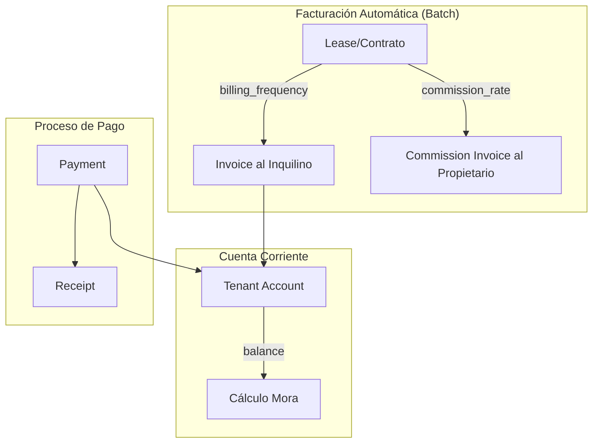

# Dominio de Pagos

## Modelo de Negocio

## Entidades

### TenantAccount
Cuenta corriente del inquilino. Una por contrato.
- `balance`: Saldo (+deuda, -crédito)
- Movimientos registran cada transacción

### Invoice
Factura del propietario al inquilino.
- Número generado por propietario o AFIP
- Puede tener mora calculada
- Se aplica a cuenta corriente al emitirse

### Payment
Pago del inquilino.
- Genera recibo al confirmarse
- Se aplica a facturas pendientes (FIFO)

### CommissionInvoice
Factura de la compañía al propietario.
- Se genera al emitir factura de alquiler
- Incluye IVA

## Endpoints

| Método | Ruta | Descripción |
|--------|------|-------------|
| POST | `/payments` | Registrar pago |
| PATCH | `/payments/:id/confirm` | Confirmar pago |
| GET | `/payments/:id/receipt` | Descargar recibo |
| GET | `/tenant-accounts/:id/balance` | Balance y mora |
| POST | `/invoices` | Crear factura |
| PATCH | `/invoices/:id/issue` | Emitir factura |
