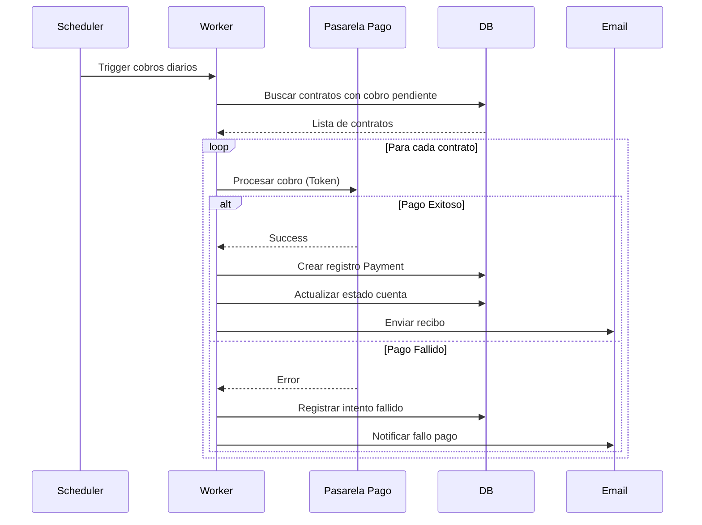
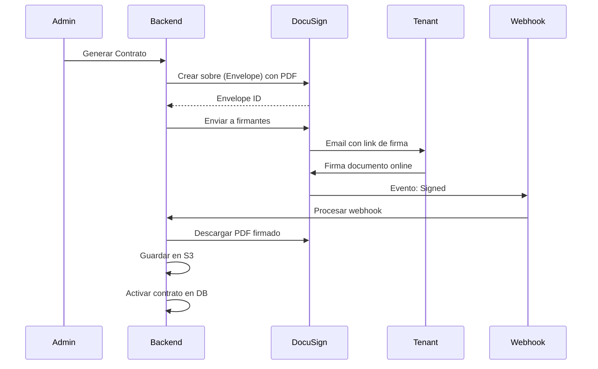
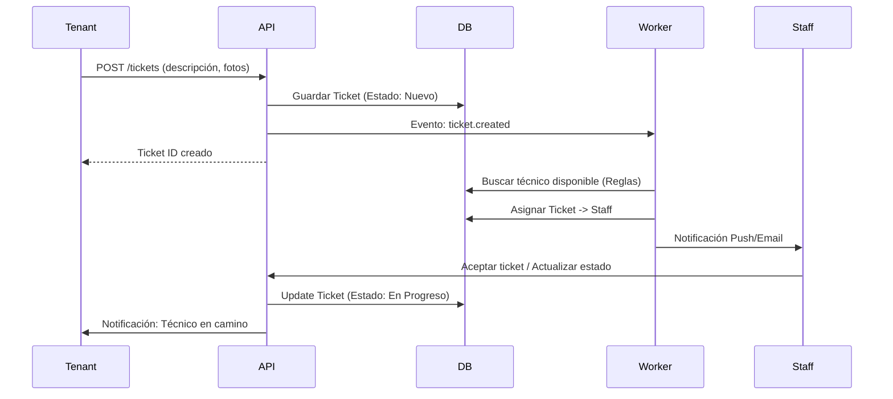
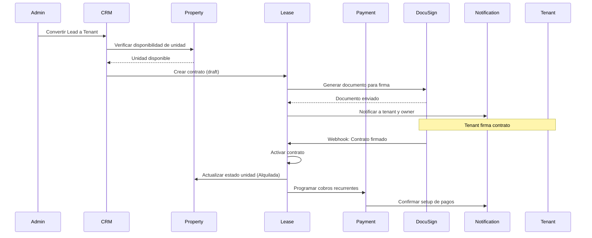
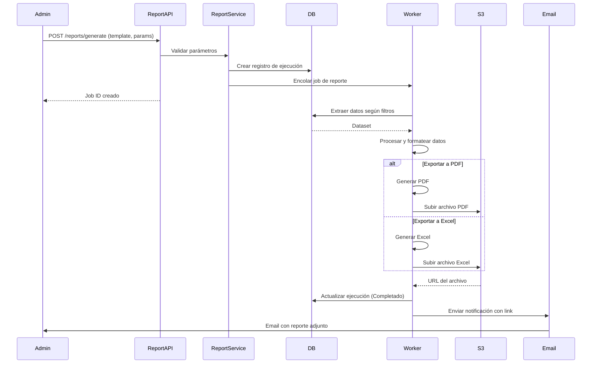
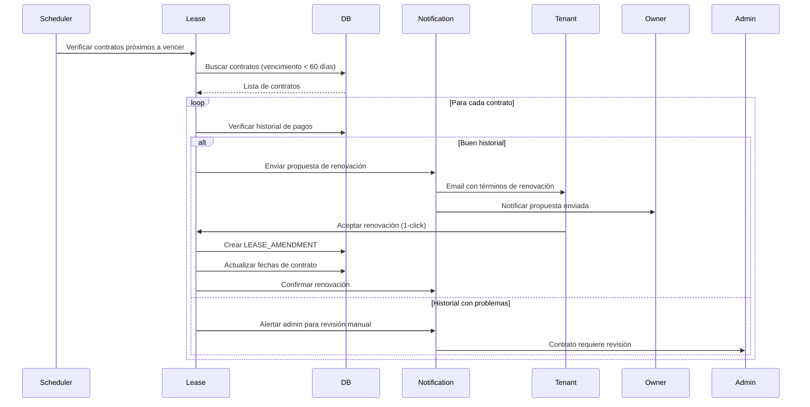

# Flujos de Procesos (Secuencia)

### 1. Cobro Recurrente Automático

### 2. Firma Digital de Contrato

### 3. Solicitud de Mantenimiento

### 4. Registro de Nuevo Alquiler

### 5. Generación de Reportes

### 6. Captura y Seguimiento de Leads (CRM)

### 7. Renovación de Contrato

