# Flujos de Procesos (Secuencia)

### 1. Cobro Recurrente Automático

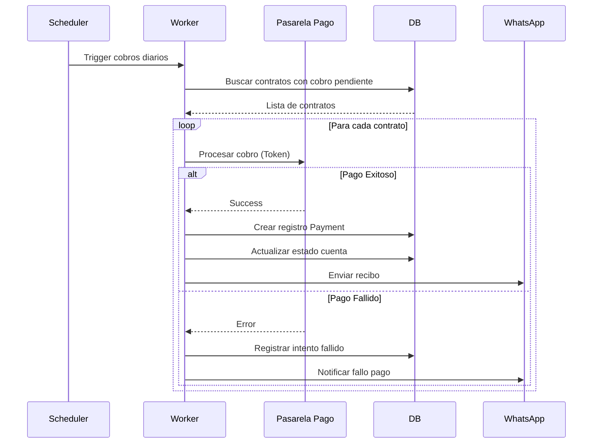

### 2. Firma Digital de Contrato

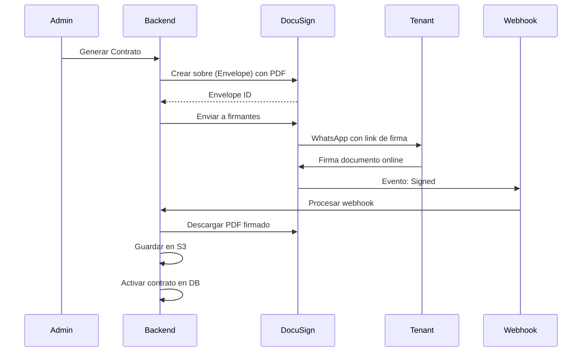

### 3. Solicitud de Mantenimiento

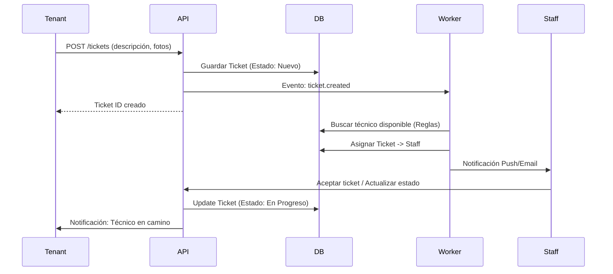

### 4. Registro de Nuevo Alquiler

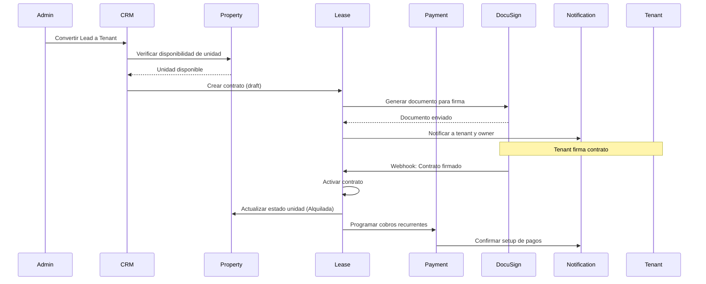

### 5. Generación de Reportes

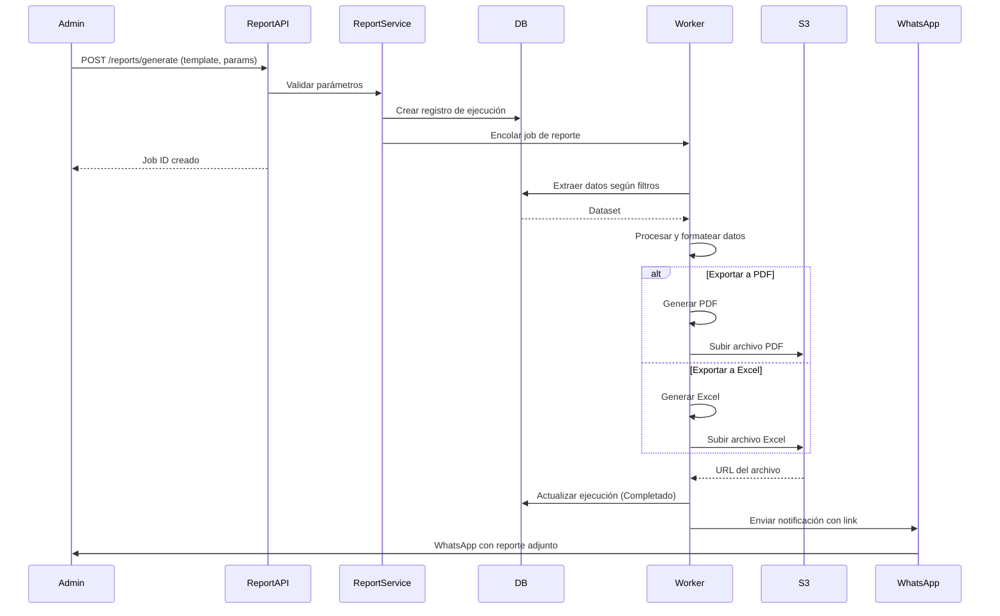

### 6. Captura y Seguimiento de Leads (CRM)

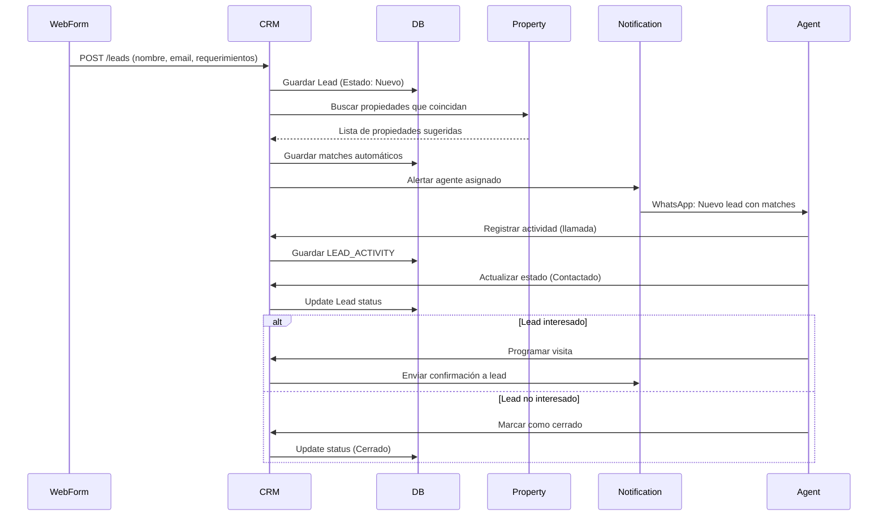

### 7. Renovación de Contrato

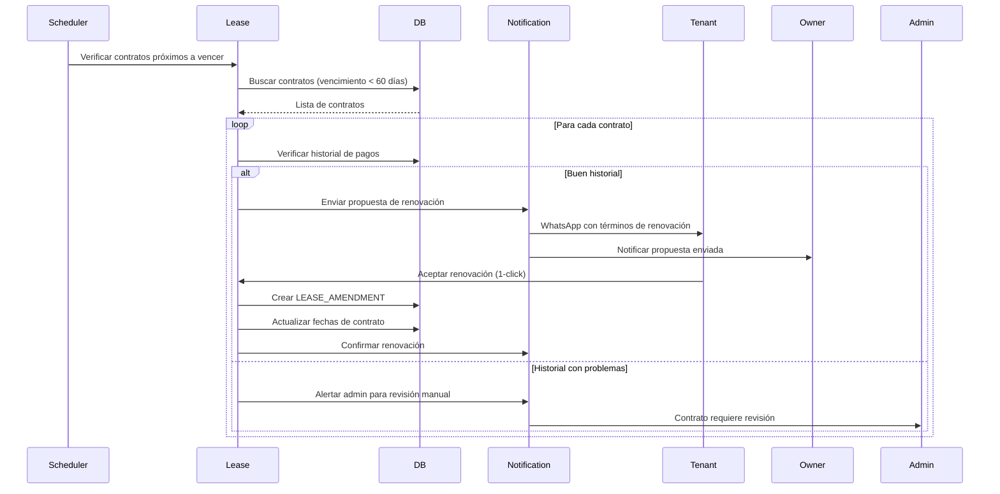

---

## Flujos de Facturación y Cobranzas

### 8. Facturación por Lotes (Billing Batch)

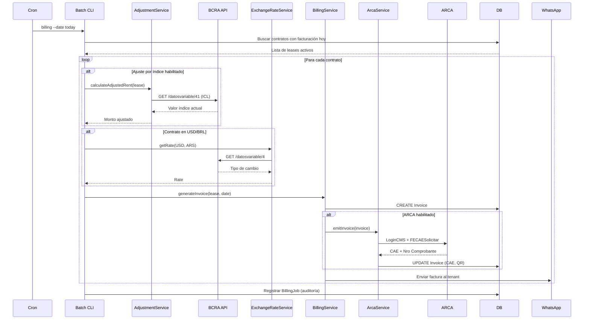

### 9. Procesamiento de Pago (MercadoPago)

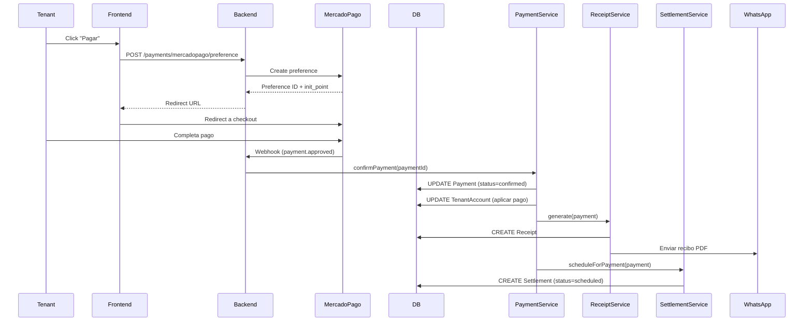

### 10. Procesamiento de Pago Crypto

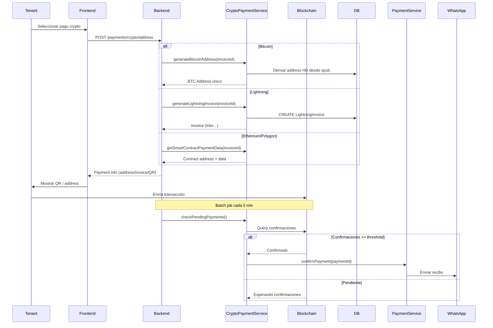

### 11. Conciliación Bancaria

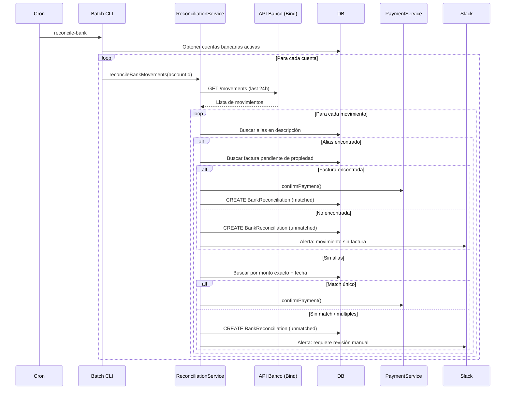

### 12. Liquidación a Propietarios

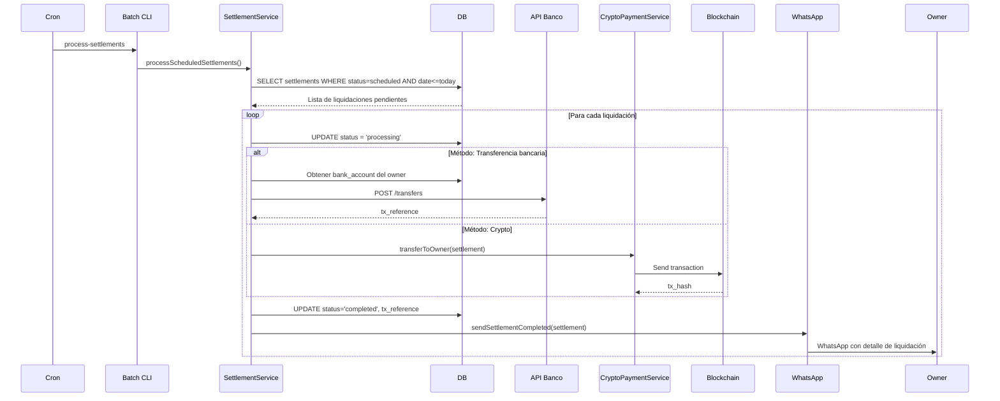

### 13. Sincronización de Índices de Inflación

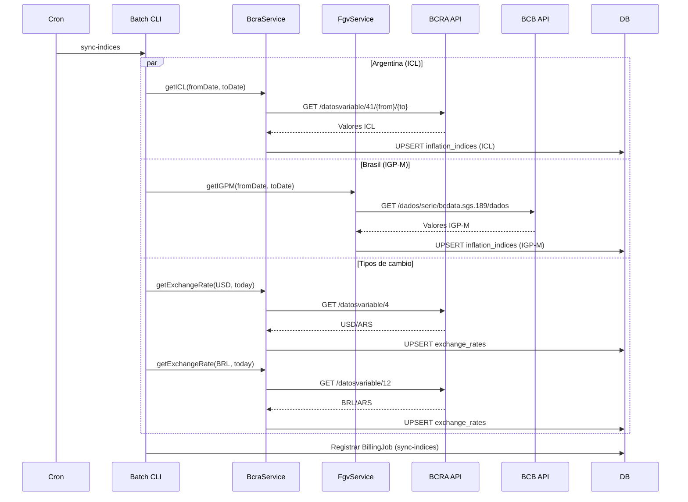

### 14. Recordatorios y Mora

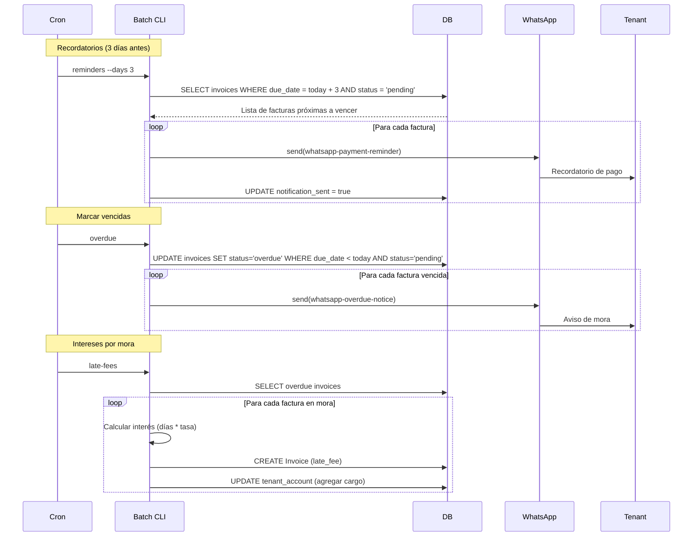

